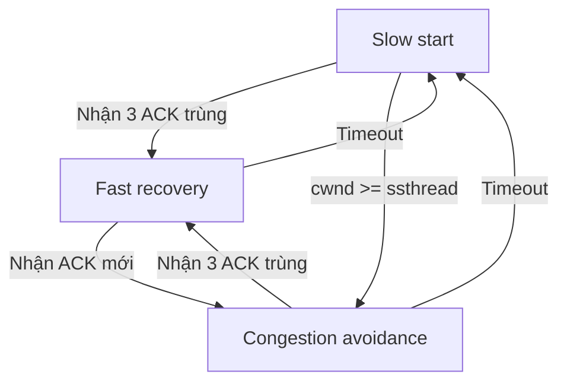
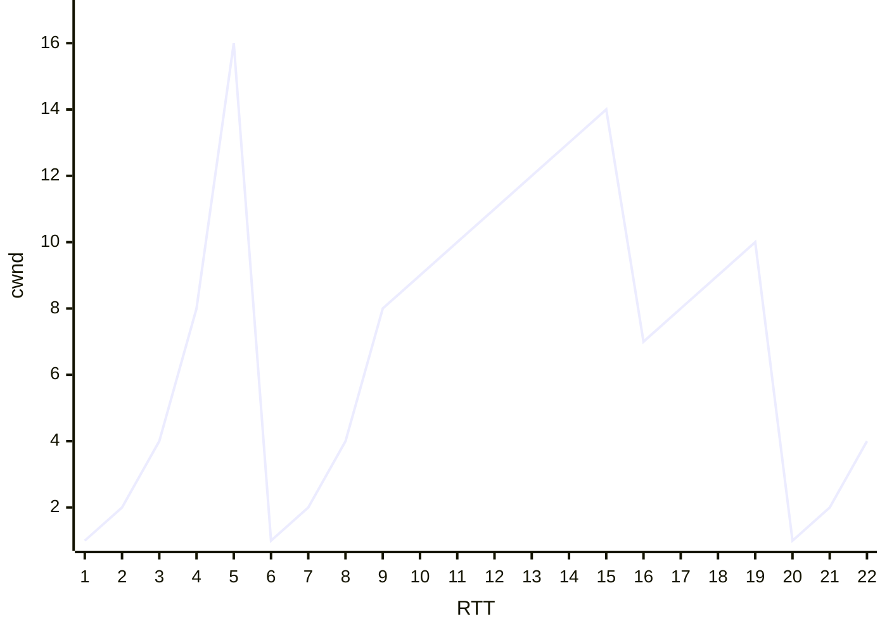

```insta-toc
---
title:
  name: Mục lục
  level: 1
  center: false
exclude: ""
style:
  listType: number
omit: []
levels:
  min: 1
  max: 6
---

# Mục lục

1. Các dịch vụ của tầng transport
2. Giao thức TCP / UDP
3. Truyền dữ liệu đáng tin cậy
    1. Kiểm tra lỗi gói tin qua checksum
    2. Các chiến lược xây dựng kênh truyền tin đáng tin cậy (RDT)
        1. Các chiến lược dựa trên nguyên lý stop-and-wait
        2. Các chiến lược dựa trên nguyên lý pipelining
    3. Chiến lược RDT trên thực tế của TCP
4. Chiến lược điều khiển luồng của TCP
5. Chiến lược quản lý kết nối của TCP
    1. Mở kết nối - 3-ways handshake
    2. Đóng kết nối - 4-ways handshake
6. Tắc nghẽn (Congestion)
    1. Nguyên nhân xảy ra tắc nghẽn
    2. Điều khiển tắc nghẽn của TCP bằng AIMD
```

**[[1. Tổng quan về mạng máy tính#Phân tầng mạng|Transport layer]]**: Chuyển tiếp dữ liệu giữa các tiến trình (TCP, UDP).

# Các dịch vụ của tầng transport

1. **Truyền dữ liệu đáng tin cậy (RDT, Reliable Data Transfer)** (khác với truyền tin cậy ở tầng link là xử lý lỗi ở cục bộ giữa các nút):
    - Đảm bảo dữ liệu tới đích đầy đủ, đúng thứ tự, không lỗi.
    - Một số ứng dụng **chịu mất mát (loss-tolerant)**: âm thanh, video -> có thể chấp nhận mất vài gói.
    - Nguyên lý: [[3. Transport layer#Truyền dữ liệu đáng tin cậy|Truyền dữ liệu đáng tin cậy]].

2. **Throughput (Thông lượng):**
    - Số bit/giây có thể chuyển giữa 2 tiến trình. Có 2 loại là:
	    - **Bandwidth-sensitive applications**: Yêu cầu thông lượng cố định.
	    - **Elastic applications**: Yêu cầu thông lượng tùy nghi theo tình hình thực tế.

3. **Timing (Độ trễ thời gian)**
    - Đảm bảo dữ liệu tới trong một khoảng thời gian nhất định.

4. **Security (Bảo mật)**
    - Mã hóa dữ liệu, bảo mật, toàn vẹn, xác thực.

# Giao thức TCP / UDP

Tầng vận chuyển có 2 giao thức chính là TCP và UDP.

|                     | TCP<br>(Transmission control protocol)                                                                                                                                                                                                                                                                                                                                                                                                                                                                                                                                                                                                                            | UDP<br>(User datagram protocol)                                                                                                     |
| ------------------- | ----------------------------------------------------------------------------------------------------------------------------------------------------------------------------------------------------------------------------------------------------------------------------------------------------------------------------------------------------------------------------------------------------------------------------------------------------------------------------------------------------------------------------------------------------------------------------------------------------------------------------------------------------------------- | ----------------------------------------------------------------------------------------------------------------------------------- |
| **Nền tảng**        | [[4. Network layer#Mạch ảo và Mạch gói tin\|Mạch ảo (Hướng kết nối)]].                                                                                                                                                                                                                                                                                                                                                                                                                                                                                                                                                                                            | [[4. Network layer#Mạch ảo và Mạch gói tin\|Mạch gói tin (Phi kết nối)]].                                                           |
| **Cấu trúc header** | **Các trường**:<br>- `Source port`: Cổng nguồn.<br>- `Dest port`: Cổng đích.<br>- `Sequence number`: Số thứ tự của byte đầu tiên của segment.<br>- `ACK number`: `Seq` của segment tiếp theo.<br>- `Recieve window`: Số lượng byte mà bên nhận có thể nhận thêm.<br>- `Checksum`:<br>- `Urgent pointer`.<br>- `TCP options`.<br><br>**Các cờ**:<br>- `ACK`: Đánh dấu đây là segment chứa `ACK number`.<br>- `SYN`: Đánh dấu đây là segment đề nghị *mở kết nối*.<br>- `FIN`: Đánh dấu đây là segment đề nghị *đóng kết nối*.<br>- `URG`, `PSH`, `RST`.<br><br>=> Server có thể thực hiện nhiều TCP connection vì mỗi connection đều định danh được nguồn và đích. | - Source port number.<br>- Dest*ination* port number.<br>- Content length.<br>- Checksum.<br><br>Mỗi trường có 2 byte, tổng 8 byte. |
| **Đặc điểm**        | - **Point-to-Point**: 1 bên gửi - 1 bên nhận.<br>- Truyền tin cậy.<br>- **Full duplex**: 1 host có thể vừa nhận vừa gửi cùng lúc (*luồng 2 chiều*).<br>- **Handshaking**: 2 host kết nối trước khi truyền.<br>- **Flow control**: Giảm tốc độ khi tắc nghẽn.                                                                                                                                                                                                                                                                                                                                                                                                      | - Ngược lại với TCP.<br><br>- Thiết lập đơn giản, nhỏ gọn.<br><br>- Tốc độ cao.                                                     |
| **Ví dụ**           | Email, Web, FTP, Remote login.                                                                                                                                                                                                                                                                                                                                                                                                                                                                                                                                                                                                                                    | DNS, VoIP, game online, streaming video.                                                                                            |

>[!important]
>UDP **best effort** - nỗ lực truyền tin nhưng không đảm bảo chính xác.
>Tuy vậy, UDP **vẫn có bước kiểm tra lỗi khi truyền gói tin**.

>[!important]
>- **TCP/UDP** *không* đảm bảo **thông lượng, độ trễ, bảo mật**.
>- Để giải quyết vấn đề bảo mật, thường thông qua **TLS (Transport layer security)** ở **tầng ứng dụng** để *mã hóa dữ liệu trước khi gửi*.

Một số protocol tầng Ứng dụng dựa trên TCP/UDP:

| Protocol                                      | Dựa trên                | Port | Chức năng                                                         | Đặc điểm                                                                                                |
| --------------------------------------------- | ----------------------- | ---- | ----------------------------------------------------------------- | ------------------------------------------------------------------------------------------------------- |
| **HTTP<br>(Hypertext transfer protocol)**     | TCP<br><br>UDP (HTTP/3) | 80   | Lấy dữ liệu về từ server.                                         | - Có 2 dạng là bền vững và không bền vững.<br><br>- Msg có thể ở dạng **ASCII 8-bit** (`\n`, `\r`,...). |
| **SMTP**<br>*(Simple Mail Transfer Protocol)* | TCP                     | 25   | Gửi mail vào mailbox của người nhận.                              | - Bền vững.<br><br>- Msg phải ở dạng **ASCII 7-bit** (`CRLF.CRLF`,...).                                 |
| **POP**<br>*(Post Office Protocol)*           | TCP                     | 110  | Tải mail về client rồi xóa mail đó ở mailbox.                     |                                                                                                         |
| **IMAP**<br>*(Internet Mail Access Protocol)* | TCP                     | 143  | Cũng như POP, nhưng mail vẫn còn ở mailbox chứ không tự động xóa. |                                                                                                         |
| **DNS<br>(Domain name system)**               | TCP / UDP               | 53   | Gửi query để tra cứu IP và response để trả về IP.                 |                                                                                                         |
| **SNMP**                                      | UDP                     |      |                                                                   |                                                                                                         |

# Truyền dữ liệu đáng tin cậy

## Kiểm tra lỗi gói tin qua checksum

**Quy trình**:
- Bên gửi:
	- Chia dữ liệu thành các chuỗi 16 bit. Nếu không đủ 16 bit thì bù bit `0` vào trước chuỗi.
	- Tính **tổng bù 1 (1’s complement sum)** trên từng chuỗi.
	- Đưa vào header.

- Bên nhận:
	- Cộng tất cả (bao gồm checksum).
	- Nếu kết quả giống trường `checksum` của header, gói tin *có khả năng có lỗi*; ngược lại thì *chắc chắn có lỗi.*

>[!important]
>Trong các trường hợp như **dữ liệu bị đảo**, checksum không kiểm tra được lỗi (*vì `A + B` = `B + A`*).

VD:

Gói tin:
- Source Port: `0x1F90` (8080)
- Dest Port: `0x0045` (69)
- Length: `0x001C` (28 byte)
- Data: `0x54657374`.

Cộng dồn các giá trị
```
0x1F90 + 0x0045 + 0x001C + 0x54657374 = 0x546593DD
```

Lấy bù 1:
```
0xAB9A6C22
```

Vậy, checksum là `0xAB9A6C22`.

Khi nhận, bên nhận cũng tính checksum và nếu cũng ra `0xAB9A6C22` thì dữ liệu được cho là không có lỗi.

## Các chiến lược xây dựng kênh truyền tin đáng tin cậy (RDT)

### Các chiến lược dựa trên nguyên lý stop-and-wait

**Stop-and-wait** là sau khi bên gửi gửi 1 gói tin:
- Router sẽ đợi cho đến khi bên nhận gửi lời xác nhận segment (có lỗi hay không).
- Sau đó bên gửi mới tiếp tục gửi segment khác.

Hiệu suất:
$$U=\frac{\frac{L}{R}}{\frac{L}{R}+\text{RTT}}$$

Các cơ chế dùng trong stop-and-wait:
1. **RDT 1.0**: *Giả sử kênh truyền đáng tin cậy hoàn toàn.*
	1. Như vậy, mỗi router chỉ cần đợi nhận segment, và gửi segment đi mà thôi.

2. **RDT 2.0**: *ARQ (Automatic repeat request).*
	1. Bên gửi: Gửi segment.
	2. Bên nhận: Nhận gói, dùng checksum và gửi thông báo về cho bên gửi:
		1. Nếu có lỗi: Gửi **NAK** *(Negative acknowledgement)*.
		2. Nếu không lỗi: Gửi **ACK** *(Acknowledgement)*.
	3. Bên gửi:
		1. Nhận được **NAK** -> Gửi lại gói và chờ tiếp.
		2. Nhận được **ACK** -> Hoàn thành nhiệm vụ.

3. **RDT 2.1**: *Alternating-bit protocol*:
	2. Mỗi gói được đánh một số thứ tự (bit `0` hoặc `1`) để phân biệt. Bên gửi chỉ gửi gói có bit `0` và bên nhận chỉ gửi gói có bit `1`
	3. Khi ACK/NAK bị hỏng, bên gửi có thể gửi lại gói gần nhất.
	4. Bên nhận nhờ các bit này để biết gói đó là mới hay là bản sao.

4. **RDT 2.2**: *NAK free*.
	1. Thay vì gửi NAK, bên nhận chỉ gửi ACK.
	2. Nếu bên nhận thấy ACK mới được gửi về giống ACK trước đó thì tức là có lỗi (*vẫn dựa trên các bit phân biệt*).

	**Thứ tự các trạng thái của bên gửi**:
	1. Đợi nhận segment có `Seq` = `0` từ tầng trên -> Gửi segment đi cho bên nhận.
	2. Đợi nhận ACK `0` từ bên nhận -> Nếu phát sinh lỗi thì vẫn đợi.
	3. Đợi nhận segment có `Seq` = `1` từ tầng trên ...
	4. Đợi nhận ACK `1` từ bên nhận ...
	
	**Thứ tự các trạng thái của bên nhận**:
	1. Đợi nhận segment có `Seq` = `0` từ tầng dưới -> Gửi ACK cho bên gửi.
	2. Đợi nhận segment có `Seq` = `1` từ tầng dưới ...

5. **RDT 3.0**: *Timer*: Giải quyết vấn đề mất gói. Nếu quá một khoảng thời gian quy định mà bên gửi vẫn chưa nhận về ACK/NAK thì tự động gửi gói lại.

### Các chiến lược dựa trên nguyên lý pipelining

**Pipeling** cho phép bên gửi gửi hàng loạt gói tin thay vì gửi từng gói một như *stop-and-wait*.

Các cơ chế dùng trong pipelining:
1. **Go-back-N (GBN)**:
	- Bên gửi *gửi liên tiếp một số lượng packet* cố định theo kích thước **cửa sổ trượt (Send window)** mà không cần chờ ACK.
	- Lúc này có 3 trường hợp xảy ra:
		1. Gói tin chuyển đi bình thường, không có chuyện gì xảy ra, bên nhận nhận gửi tin và trả về 1 ACK. Với mỗi ACK, cửa sổ trượt 1 gói tin.
		2. Gói tin thứ $i$ bị lỗi, bên nhận sẽ **không nhận** gói tin từ $i+1$ trở đi mà **trả về ACK $i-1$ (mới nhất)**. Bên gửi thấy ACK trả về bị trùng thì sẽ gửi lại các gói tin từ $i$ đến hết cửa sổ.
		3. ACK thứ $i$ trả về bị lỗi, bên gửi tự cho rằng gói tin đã gửi thành công, **tự xác nhận ACK thứ $i$ thành công** (**tích lũy ACK**).

2. **Selective repeat (SR)**:
	- Cũng giống GBN, nhưng bên nhận sẽ **nhận các gói sai thứ tự** thay vì hủy đi toàn bộ.
	- Lúc này có 3 trường hợp xảy ra:
		1. Gói tin chuyển đi bình thường, không có chuyện gì xảy ra, bên nhận nhận gửi tin và trả về 1 ACK. Với mỗi ACK, cửa sổ trượt 1 gói tin.
		2. Gói tin thứ $i$ bị lỗi, bên nhận sẽ **nhận** gói tin từ $i+1$ trở đi vào buffer. Bên gửi thấy thiếu ACK nào thì chỉ gửi lại gói tin đó, không dịch cửa sổ.
		3. ACK thứ $i$ trả về bị lỗi, bên gửi gửi lại gói tin $i$, không dịch cửa sổ.

Hoạt ảnh mô phỏng:
- [GBN](https://media.pearsoncmg.com/aw/ecs_kurose_compnetwork_7/cw/content/interactiveanimations/go-back-n-protocol/index.html).
- [SR](https://media.pearsoncmg.com/aw/ecs_kurose_compnetwork_7/cw/content/interactiveanimations/selective-repeat-protocol/index.html).

## Chiến lược RDT trên thực tế của TCP

**Một số quan điểm**:
- ACK bị lỗi -> Hỏng gói tin.
- Mất ACK -> Hỏng / mất gói tin.
- Timeout -> Mất gói tin.

**Công thức tính timeout**: Tính theo thứ tự sau:

$$
\begin{align}
&\text{RTT}_\text{sample}=t_\text{nhận ACK}-t_\text{gửi}\tag{1}\\
&\text{RTT}_\text{dev}=(1-\beta).\text{RTT}_\text{dev}+\beta.|\text{RTT}_\text{sample}-\text{RTT}_\text{estimated}|;\quad\beta=0.25\tag{2}\\
&\text{RTT}_\text{estimated}=(1-\alpha).\text{RTT}_\text{estimated}+\alpha.\text{RTT}_\text{sample};\quad\alpha=0.125\tag{3}\\
&\text{TimeoutInterval}=4.\text{RTT}_\text{dev}+\text{RTT}_\text{estimated}\tag{4}
\end{align}
$$
Trong đó:
- **Sample RTT**: Là RTT thực, khác nhau ở mỗi lần đo.
- **Deviation of RTT (Safety margin)**: Là biên độ dao động của Sample RTT.
- **Estimated RTT**: Là giá trị trung bình của RTT.
- Nếu thời gian đợi ACK vượt quá đại lượng **TimeoutInterval** thì tính là timeout.

TCP sử dụng thuật toán đảm bảo RDT dựa trên **Selective repeat (SR)** có ACK tích lũy:
- **Đối với bên gửi**:
	1. **Khi nhận dữ liệu từ tầng ứng dụng**: Phân chia thành các segment, mỗi segment có trường `Seq`. Ban đầu, `Seq` = `Seq #` (Số thứ tự của byte đầu tiên trong segment).
	2. **Khi nhận được ACK**:
		- Cập nhật trạng thái, cập nhật thời gian, dịch chuyển window.
		- Nếu nhận được 3 ACK giống nhau thì sẽ tự gửi segment mà không cần chờ timeout (**Cơ chế Truyền lại nhanh**).
	3. **Khi timeout**: Gửi lại segment bị timeout, tính lại thời gian.

- **Đối với bên nhận**:
	1. **Nhận được segment có `Seq` đúng như mong đợi, đồng thời tất cả segment trước đó đã được ACK**: Chờ segment kế tiếp trong 500ms, nếu không nhận được thì gửi về ACK.
	2. **Nhận được segment có `Seq` đúng như mong đợi, nhưng có segment trước đó chưa được ACK**: Gửi ACK tích lũy để tự xác nhận segment trước đó.
	3. **Nhận được segment có `Seq` cao hơn mong đợi**: Gửi lại ACK của segment cũ (Duplicated ACK).
	4. **Nhận được segment có `Seq` thấp hơn mong đợi**: Gửi lại ACK của segment cũ thấp nhất mà bên nhận nhận được.

# Chiến lược điều khiển luồng của TCP

Điều khiển luồng là điều khiển số byte mà host nhận được. Phù hợp khi tốc độ xử lý của host không tương thích với tốc độ xử lý của transport layer.

Các bước điều khiển luồng:
1. Khi thấy dữ liệu đến, bên nhận lưu tạm nó vào buffer.
2. Bên nhận thông báo dung lượng còn trống cho buffer thông qua trường **Recieve window** (số byte mà bên nhận có thể nhận được).
3. Buffer sẽ gửi một lượng dữ liệu tối đa bằng recieve window cho server.

>[!important]
>Recieve window chính là cửa sổ trượt trong nguyên lý RDT bằng pipelining.

# Chiến lược quản lý kết nối của TCP

## Mở kết nối - 3-ways handshake

**Chỉ có client** mới có thể yêu cầu mở kết nối.

Quy trình mở kết nối:
1. A muốn mở kết nối, gửi cho B segment có:
	1. Cờ `SYN` = `1`.
	2. Trường `Seq` = `x` là số thứ tự segment khởi đầu.
2. B nhận segment, chấp nhận kết nối gửi về A:
	1. Cờ `SYN` = `1`.
	2. Cờ `ACK` = `1`.
	3. Trường `Seq` = `y` là số thứ tự segment.
	4. Trường `ACK` = `x + 1` là số thứ tự segment B muốn nhận tiếp theo.
3. A nhận segment, gửi về:
	1. Cờ `ACK` = `1`.
	2. Trường `ACK` = `y + 1`.

## Đóng kết nối - 4-ways handshake

**Cả client hoặc server** đều có thể yêu cầu đóng kết nối.

Quy trình đóng kết nối:
1. A muốn đóng kết nối, gửi cho B segment có trường `FIN` = 1.
2. B nhận được segment, gửi về:
	1. Segment 1: `ACK` = 1.
	2. Các segment trung gian khác.
	3. Segment 2: `FIN` = 1.
3. A nhận được 2 segment trên, gửi lại `ACK` để xác nhận đóng kết nối.

>[!note]
>B chỉ xác nhận đóng kết nối khi đã gửi hết các dữ liệu cần gửi cho A. Cho nên cần 2 segment như trên.
>Trong trường hợp không có dữ liệu trung gian, có thể gộp lại thành 1 segment.

# Tắc nghẽn (Congestion)

## Nguyên nhân xảy ra tắc nghẽn

1. Tốc độ gửi, truyền tin hữu hạn.
2. Bộ nhớ hữu hạn.

## Điều khiển tắc nghẽn của TCP bằng AIMD

Gọi:
- **cwnd (Congestion window)**:
	- Tổng kích thước lớn nhất được phép gửi các gói tin.
	- Đơn vị là **MSS (Maxium segment size, kích thước gói tin tối đa)**.
	- Tốc độ gửi tỷ lệ thuận với cwnd.

- **ssthread (Slow start threshold)**:
	- Ngưỡng kết thúc giai đoạn slowstart và chuyển sang congestion avoidance.
	- Thường là một ngưỡng khá lớn.

**AIMD (Thăm dò băng thông)**: Bên gửi liên tục tăng tốc độ truyền cho đến khi việc mất gói tin xảy ra, sau đó giảm tốc độ truyền dựa trên sự kiện mất.

**3 giai đoạn điều khiển tắc nghẽn**:
1. **Slow start**: Ban đầu, cwnd = 1 MSS. Sau đó gấp đôi sau mỗi RTT:
$$ \text{cwnd}_i = \text{cwnd}_{i-1} \times 2 $$

2. **Congestion avoidance**:
	- Khi cwnd ≥ ssthread, cwnd chỉ tăng 1 SSM sau mỗi RTT:
$$ \text{cwnd}_i = \text{cwnd}_{i-1} + 1 $$

3. **Fast recovery**:
	1. **Khi bên gửi nhận được 3 ACK trùng nhau**, TCP cho rằng có gói tin bị mất, đẩy nhanh cwnd để gửi lại:
$$ \text{cwnd}_i = \frac{\text{cwnd}_{i-1}}{2} + 3 $$
	2. **Khi timeout**, mạng đã bị nghẽn do gói tin không gửi được, quay về slow start.
$$ \text{cwnd}_i = 1 $$

Điều kiện kích hoạt 3 trạng thái:


VD: Cho biểu đồ:


- **Slow start**: Những đoạn *uốn cong cấp số nhân* (1 - 5, 6 - 9, 21 - 22).
- **Congestion avoidance**: Những đoạn *thẳng tăng tuyến tính* (9 - 15, 16 - 19).
- **Fast recovery**: Những đoạn *thẳng giảm tuyến tính* (15 - 16).
