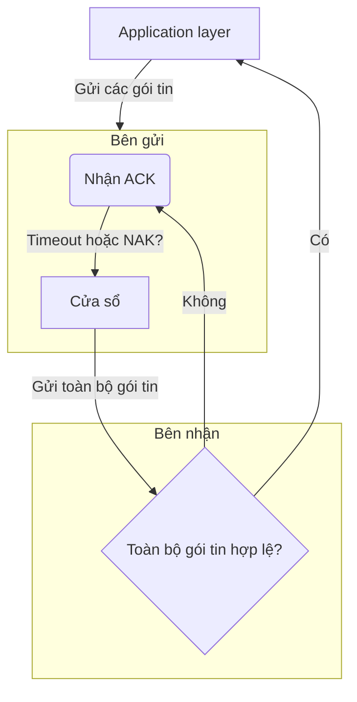
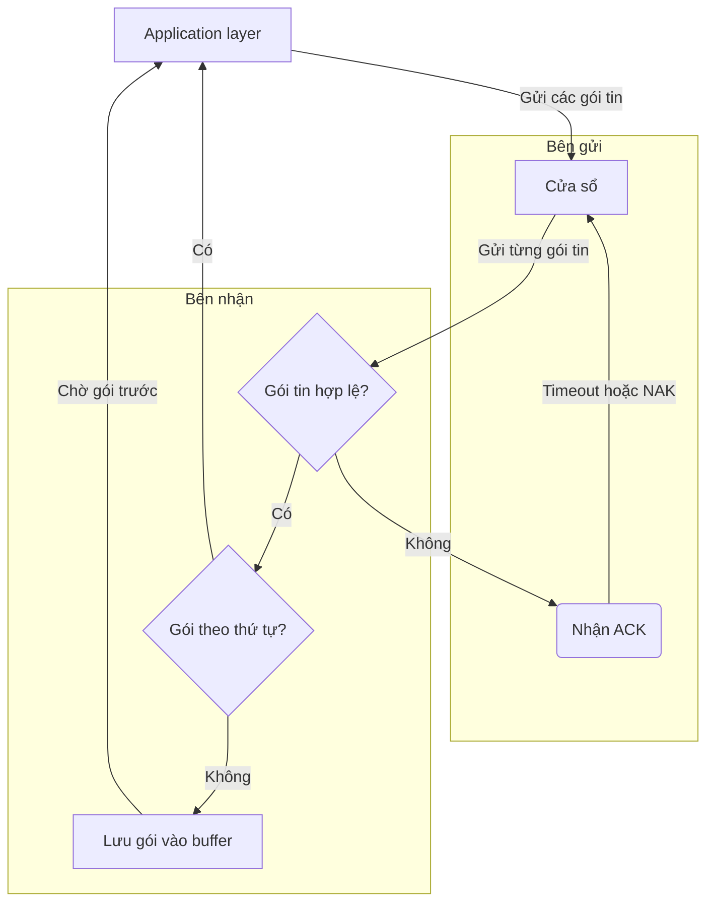
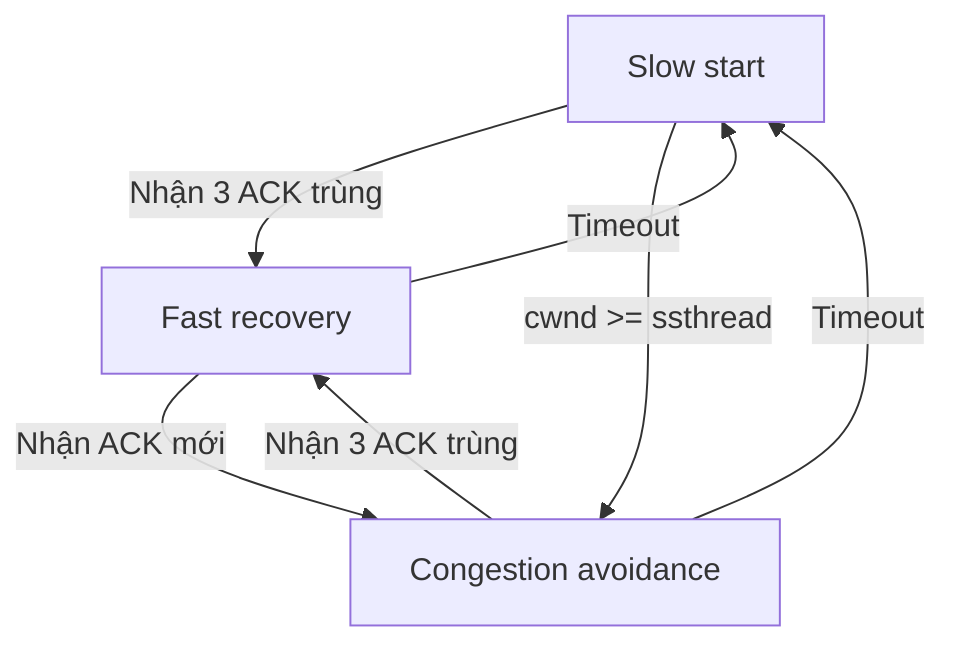
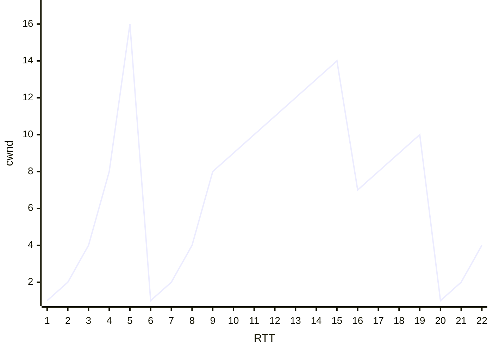

```insta-toc
---
title:
  name: Mục lục
  level: 1
  center: false
exclude: ""
style:
  listType: number
omit: []
levels:
  min: 1
  max: 6
---

# Mục lục

1. Các dịch vụ của tầng transport
2. Giao thức TCP / UDP
3. Truyền dữ liệu đáng tin cậy
    1. Kiểm tra lỗi gói tin qua checksum
    2. Các chiến lược xây dựng kênh truyền tin đáng tin cậy (RDT)
        1. Các chiến lược dựa trên nguyên lý stop-and-wait
        2. Các chiến lược dựa trên nguyên lý pipelining
4. Tắc nghẽn (Congestion)
    1. Nguyên nhân xảy ra tắc nghẽn
    2. Điều khiển tắc nghẽn của TCP bằng AIMD
```

**[[1. Tổng quan về mạng máy tính#Phân tầng mạng|Transport layer]]**: Chuyển tiếp dữ liệu giữa các tiến trình (TCP, UDP).

# Các dịch vụ của tầng transport

1. **Truyền dữ liệu đáng tin cậy (RDT, Reliable Data Transfer)** (khác với truyền tin cậy ở tầng link là xử lý lỗi ở cục bộ giữa các nút):
    - Đảm bảo dữ liệu tới đích đầy đủ, đúng thứ tự, không lỗi.
    - Một số ứng dụng **chịu mất mát (loss-tolerant)**: âm thanh, video -> có thể chấp nhận mất vài gói.
    - Nguyên lý: [[3. Transport layer#Truyền dữ liệu đáng tin cậy|Truyền dữ liệu đáng tin cậy]].

2. **Throughput (Thông lượng):**
    - Số bit/giây có thể chuyển giữa 2 tiến trình. Có 2 loại là:
	    - **Bandwidth-sensitive applications**: Yêu cầu thông lượng cố định.
	    - **Elastic applications**: Yêu cầu thông lượng tùy nghi theo tình hình thực tế.

3. **Timing (Độ trễ thời gian)**
    - Đảm bảo dữ liệu tới trong một khoảng thời gian nhất định.

4. **Security (Bảo mật)**
    - Mã hóa dữ liệu, bảo mật, toàn vẹn, xác thực.

# Giao thức TCP / UDP

Tầng vận chuyển có 2 giao thức chính là TCP và UDP.

|                     | TCP<br>(Transmission control protocol)                                                                                                                                                                                  | UDP<br>(User datagram protocol)                                                               |
| ------------------- | ----------------------------------------------------------------------------------------------------------------------------------------------------------------------------------------------------------------------- | --------------------------------------------------------------------------------------------- |
| **Nền tảng**        | [[4. Network layer#Mạch ảo và Mạch gói tin\|Mạch ảo (Hướng kết nối)]].                                                                                                                                                  | [[4. Network layer#Mạch ảo và Mạch gói tin\|Mạch gói tin (Phi kết nối)]].                     |
| **Cấu trúc header** | - Source IP address.<br>- Source port number.<br>- Dest*ination* IP address.<br>- Dest*ination* port number.<br><br>=> Server có thể thực hiện nhiều TCP connection vì mỗi connection đều định danh được nguồn và đích. | - Source port number.<br>- Dest*ination* port number.<br><br>- Content length.<br>- Checksum. |
| **Đặc điểm**        | - 2 tiến trình phải liên kết logic với nhau (**handshake**) trước khi truyền dữ liệu.<br><br>- **Đảm bảo dữ liệu** đúng, đủ, theo thứ tự.<br><br>- **Giảm tốc độ** khi mạng tắc nghẽn.                                  | - Ngược lại với TCP.<br><br>- Thiết lập đơn giản, nhỏ gọn.<br><br>- Tốc độ cao.               |
| **Ví dụ**           | Email, Web, FTP, Remote login.                                                                                                                                                                                          | DNS, VoIP, game online, streaming video.                                                      |

>[!important]
>UDP **best effort** - nỗ lực truyền tin nhưng không đảm bảo chính xác.
>Tuy vậy, UDP **vẫn có bước kiểm tra lỗi khi truyền gói tin**.

>[!important]
>- **TCP/UDP** *không* đảm bảo **thông lượng, độ trễ, bảo mật**.
>- Để giải quyết vấn đề bảo mật, thường thông qua **TLS (Transport layer security)** ở **tầng ứng dụng** để *mã hóa dữ liệu trước khi gửi*.

Một số protocol tầng Ứng dụng dựa trên TCP/UDP:

| Protocol                                      | Dựa trên                | Port | Chức năng                                                         | Đặc điểm                                                                                                |
| --------------------------------------------- | ----------------------- | ---- | ----------------------------------------------------------------- | ------------------------------------------------------------------------------------------------------- |
| **HTTP<br>(Hypertext transfer protocol)**     | TCP<br><br>UDP (HTTP/3) | 80   | Lấy dữ liệu về từ server.                                         | - Có 2 dạng là bền vững và không bền vững.<br><br>- Msg có thể ở dạng **ASCII 8-bit** (`\n`, `\r`,...). |
| **SMTP**<br>*(Simple Mail Transfer Protocol)* | TCP                     | 25   | Gửi mail vào mailbox của người nhận.                              | - Bền vững.<br><br>- Msg phải ở dạng **ASCII 7-bit** (`CRLF.CRLF`,...).                                 |
| **POP**<br>*(Post Office Protocol)*           | TCP                     | 110  | Tải mail về client rồi xóa mail đó ở mailbox.                     |                                                                                                         |
| **IMAP**<br>*(Internet Mail Access Protocol)* | TCP                     | 143  | Cũng như POP, nhưng mail vẫn còn ở mailbox chứ không tự động xóa. |                                                                                                         |
| **DNS<br>(Domain name system)**               | UDP                     | 53   | Gửi query để tra cứu IP và response để trả về IP.                 |                                                                                                         |
| **SNMP**                                      | UDP                     |      |                                                                   |                                                                                                         |

# Truyền dữ liệu đáng tin cậy

## Kiểm tra lỗi gói tin qua checksum

**Quy trình**:
- Bên gửi:
	- Chia dữ liệu thành các chuỗi 16 bit. Nếu không đủ 16 bit thì bù bit `0` vào trước chuỗi.
	- Tính **tổng bù 1 (1’s complement sum)** trên từng chuỗi.
	- Đưa vào header.

- Bên nhận:
	- Cộng tất cả (bao gồm checksum).
	- Nếu kết quả giống trường `checksum` của header, gói tin *có khả năng có lỗi*; ngược lại thì *chắc chắn có lỗi.*

>[!important]
>Trong các trường hợp như **dữ liệu bị đảo**, checksum không kiểm tra được lỗi (*vì `A + B` = `B + A`*).

VD:

Gói tin:
- Source Port: `0x1F90` (8080)
- Dest Port: `0x0045` (69)
- Length: `0x001C` (28 byte)
- Data: `0x54657374`.

Cộng dồn các giá trị
```
0x1F90 + 0x0045 + 0x001C + 0x54657374 = 0x546593DD
```

Lấy bù 1:
```
0xAB9A6C22
```

Vậy, checksum là `0xAB9A6C22`.

Khi nhận, bên nhận cũng tính checksum và nếu cũng ra `0xAB9A6C22` thì dữ liệu được cho là không có lỗi.

## Các chiến lược xây dựng kênh truyền tin đáng tin cậy (RDT)

### Các chiến lược dựa trên nguyên lý stop-and-wait

**Stop-and-wait** là sau khi bên gửi gửi 1 gói tin:
- Router sẽ đợi cho đến khi bên nhận gửi lời xác nhận segment (có lỗi hay không).
- Sau đó bên gửi mới tiếp tục gửi segment khác.

Các cơ chế dùng trong stop-and-wait:
1. **RDT 1.0**: *Giả sử kênh truyền đáng tin cậy hoàn toàn.*
	1. Như vậy, mỗi router chỉ cần đợi nhận segment, và gửi segment đi mà thôi.

2. **RDT 2.0**: *ARQ (Automatic repeat request).*
	1. Bên gửi: Gửi segment.
	2. Bên nhận: Nhận gói, dùng checksum và gửi thông báo về cho bên gửi:
		1. Nếu có lỗi: Gửi **NAK** *(Negative acknowledgement)*.
		2. Nếu không lỗi: Gửi **ACK** *(Acknowledgement)*.
	3. Bên gửi:
		1. Nhận được **NAK** -> Gửi lại gói và chờ tiếp.
		2. Nhận được **ACK** -> Hoàn thành nhiệm vụ.

3. **RDT 2.1**: *Alternating-bit protocol*: Giải quyết vấn đề ACK/NAK bị lỗi.
	1. Mỗi gói được đánh một số thứ tự (bit `0` hoặc `1`) để phân biệt. 
		*VD, bên gửi chỉ gửi gói có bit `0` hay bên nhận chỉ gửi gói có bit `1`*.
	2. Khi ACK/NAK bị hỏng, bên gửi có thể gửi lại gói gần nhất.
	3. Bên nhận nhờ các bit này để biết gói đó là mới hay là bản sao.

4. **RDT 2.2**: *NAK free*.
	1. Thay vì gửi NAK, bên nhận chỉ gửi ACK.
	2. Nếu bên nhận thấy ACK mới được gửi về giống ACK trước đó thì tức là có lỗi (*vẫn dựa trên các bit phân biệt*).

5. **RDT 3.0**: *Timer*: Giải quyết vấn đề mất gói.
	1. Nếu quá một khoảng thời gian quy định mà bên gửi vẫn chưa nhận về ACK/NAK thì tự động gửi gói lại.

### Các chiến lược dựa trên nguyên lý pipelining

**Pipeling** cho phép bên gửi gửi hàng loạt gói tin thay vì gửi từng gói một như *stop-and-wait*.

Các cơ chế dùng trong pipelining:
1. **Go-back-N (GBN, pipelining)**:



2. **Selective repeat (SR)**:
	- Cũng giống GBN, nhưng bên nhận sẽ nhận các gói sai thứ tự.
	1. Các gói sai thứ tự được đưa vào bộ nhớ đệm (buffer).
	2. Khi bên nhận nhận gói mới, nó tìm cách ghép với các gói trong buffer và chuyển gói tin đi application layer.



# Tắc nghẽn (Congestion)

## Nguyên nhân xảy ra tắc nghẽn

1. Tốc độ gửi, truyền tin hữu hạn.
2. Bộ nhớ hữu hạn.

## Điều khiển tắc nghẽn của TCP bằng AIMD

Gọi:
- **cwnd (Congestion window)**:
	- Tổng kích thước lớn nhất được phép gửi các gói tin.
	- Đơn vị là **MSS (Maxium segment size, kích thước gói tin tối đa)**.
	- Tốc độ gửi tỷ lệ thuận với cwnd.

- **ssthread (Slow start threshold)**:
	- Ngưỡng kết thúc giai đoạn slowstart và chuyển sang congestion avoidance.
	- Thường là một ngưỡng khá lớn.

**AIMD (Thăm dò băng thông)**: Bên gửi liên tục tăng tốc độ truyền cho đến khi việc mất gói tin xảy ra, sau đó giảm tốc độ truyền dựa trên sự kiện mất.

**3 giai đoạn điều khiển tắc nghẽn**:
1. **Slow start**: Ban đầu, cwnd = 1 MSS. Sau đó gấp đôi sau mỗi RTT:
$$ \text{cwnd}_i = \text{cwnd}_{i-1} \times 2 $$

2. **Congestion avoidance**:
	- Khi cwnd ≥ ssthread, cwnd chỉ tăng 1 SSM sau mỗi RTT:
$$ \text{cwnd}_i = \text{cwnd}_{i-1} + 1 $$

3. **Fast recovery**:
	1. **Khi bên gửi nhận được 3 ACK trùng nhau**, TCP cho rằng có gói tin bị mất, đẩy nhanh cwnd để gửi lại:
$$ \text{cwnd}_i = \frac{\text{cwnd}_{i-1}}{2} + 3 $$
	2. **Khi timeout**, mạng đã bị nghẽn do gói tin không gửi được, quay về slow start.
$$ \text{cwnd}_i = 1 $$

Điều kiện kích hoạt 3 trạng thái:


VD: Cho biểu đồ:


- **Slow start**: Những đoạn *uốn cong cấp số nhân* (1 - 5, 6 - 9, 21 - 22).
- **Congestion avoidance**: Những đoạn *thẳng tăng tuyến tính* (9 - 15, 16 - 19).
- **Fast recovery**: Những đoạn *thẳng giảm tuyến tính* (15 - 16).
