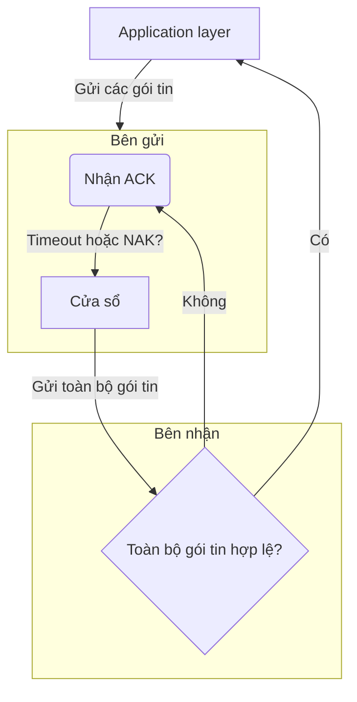
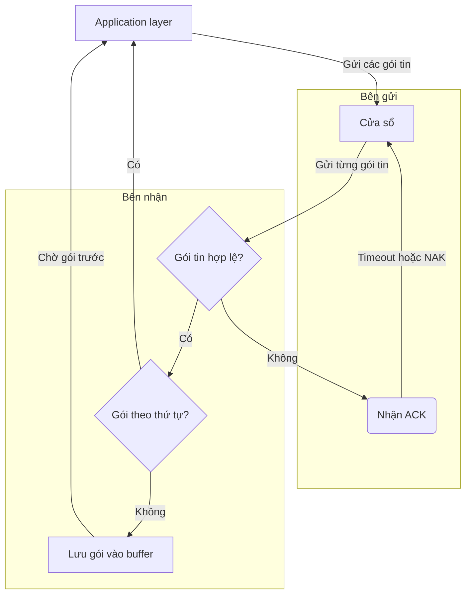
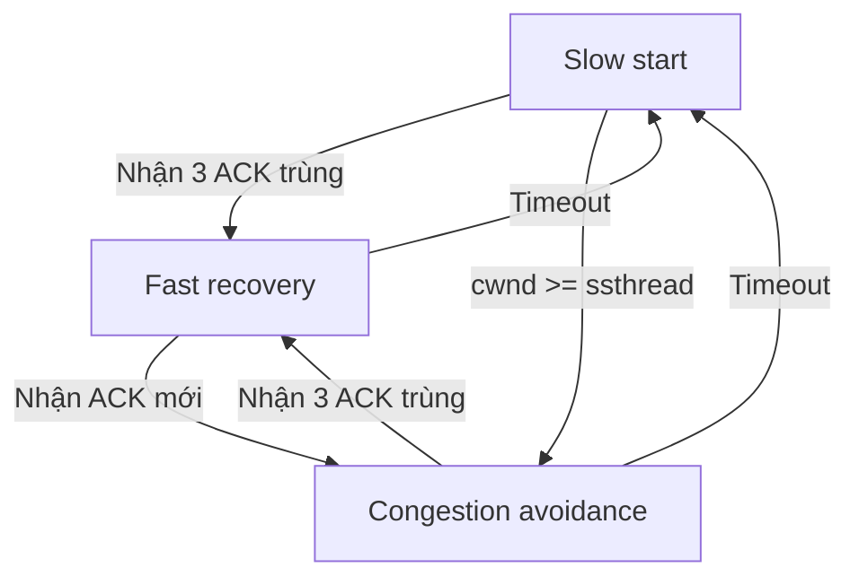
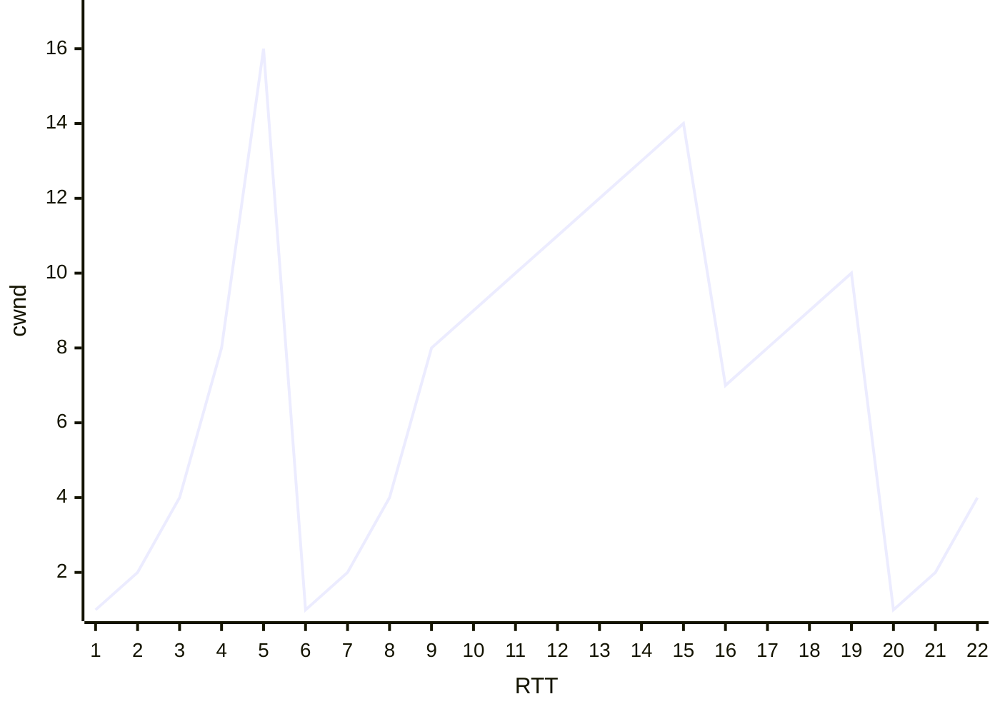

```insta-toc
---
title:
  name: Mục lục
  level: 1
  center: false
exclude: ""
style:
  listType: number
omit: []
levels:
  min: 1
  max: 6
---

# Mục lục

1. Các dịch vụ của tầng transport
2. Giao thức TCP / UDP
3. Truyền dữ liệu đáng tin cậy
    1. Kiểm tra lỗi gói tin qua checksum
    2. Các chiến lược xây dựng kênh RDT
        1. Các chiến lược dựa trên nguyên lý stop-and-wait
        2. Các chiến lược dựa trên nguyên lý pipelining
4. Tắc nghẽn (Congestion)
    1. Nguyên nhân xảy ra tắc nghẽn
    2. Điều khiển tắc nghẽn của TCP bằng AIMD
```

**[[1. Tổng quan về mạng máy tính#Phân tầng mạng|Transport layer]]**: Chuyển tiếp dữ liệu giữa các tiến trình (TCP, UDP).

# Các dịch vụ của tầng transport

1. **Truyền dữ liệu đáng tin cậy (RDT, Reliable Data Transfer)** (khác với truyền tin cậy ở tầng link là xử lý lỗi ở cục bộ giữa các nút):
    - Đảm bảo dữ liệu tới đích đầy đủ, đúng thứ tự, không lỗi.
    - Một số ứng dụng **chịu mất mát (loss-tolerant)**: âm thanh, video -> có thể chấp nhận mất vài gói.
    - Nguyên lý: [[3. Transport layer#Truyền dữ liệu đáng tin cậy|Truyền dữ liệu đáng tin cậy]].

2. **Throughput (Thông lượng):**
    - Số bit/giây có thể chuyển giữa 2 tiến trình. Có 2 loại là:
	    - **Bandwidth-sensitive applications**: Yêu cầu thông lượng cố định.
	    - **Elastic applications**: Yêu cầu thông lượng tùy nghi theo tình hình thực tế.

3. **Timing (Độ trễ thời gian)**
    - Đảm bảo dữ liệu tới trong một khoảng thời gian nhất định.

4. **Security (Bảo mật)**
    - Mã hóa dữ liệu, bảo mật, toàn vẹn, xác thực.

# Giao thức TCP / UDP

|               | TCP<br>(Transmission control protocol)                                                                                                                                                                                                                                                                                                                                                                    | UDP<br>(User datagram protocol)                                                                                                                                                                                                                          |
| ------------- | --------------------------------------------------------------------------------------------------------------------------------------------------------------------------------------------------------------------------------------------------------------------------------------------------------------------------------------------------------------------------------------------------------- | -------------------------------------------------------------------------------------------------------------------------------------------------------------------------------------------------------------------------------------------------------- |
| **Nền tảng**  | [[4. Network layer#Mạch ảo và Mạch gói tin\|Mạch ảo (Hướng kết nối)]].                                                                                                                                                                                                                                                                                                                                       | [[4. Network layer#Mạch ảo và Mạch gói tin\|Mạch gói tin (Phi kết nối)]].                                                                                                                                                                                   |
| **Đặc điểm**  | - 2 tiến trình phải liên kết logic với nhau (**handshake**) trước khi truyền dữ liệu.<br><br>- **Đảm bảo dữ liệu** đúng, đủ, theo thứ tự.<br><br>- **Giảm tốc độ** khi mạng tắc nghẽn.                                                                                                                                                                                                                    | Ngược lại với TCP.                                                                                                                                                                                                                                       |
| **Nguyên lý** | 1. 2 tiến trình liên kết logic với nhau trước khi truyền dữ liệu. <br><br>2. **Multiplexing**:  Ở bên gửi, thu thập dữ liệu từ nhiều tiến trình khác nhau, đóng gói thêm **header port, địa chỉ IP** để tạo thành segment, rồi đưa xuống network layer.  <br> <br>3. **Demultiplexing**: Ở bên nhận, transport layer kiểm tra **port number** của segment đến, rồi giao cho đúng socket / ứng dụng.  <br> | 1. Nhận dữ liệu từ ứng dụng.<br><br>2. Gắn **số cổng nguồn (source port)** và **số cổng đích (destination port)** để phục vụ ghép / tách kênh.<br>    <br>3. Thêm vài trường nhỏ khác.<br>    <br>4. Gửi xuống network layer để gói vào **IP datagram**. |
| **Ví dụ**     | Email, Web, FTP, Remote login.                                                                                                                                                                                                                                                                                                                                                                            | DNS, VoIP, game online, streaming video.                                                                                                                                                                                                                 |

**TCP/IP** không đảm bảo thông lượng và độ trễ, các ứng dụng phải tùy nghi xử lý.

**TCP/IP** không mã hóa, bảo mật kém -> Thường kèm theo **Transport Layer Security (TLS)** *mã hóa* dữ liệu trước khi gửi.

# Truyền dữ liệu đáng tin cậy

## Kiểm tra lỗi gói tin qua checksum

**Quy trình**:
- Bên gửi: Tính **tổng bù 1 (1’s complement sum)** trên tất cả các từ 16-bit trong gói tin. Nếu tràn bit thì quấn vòng (wrap around). Kết quả đảo bit (bù 1) được ghi vào checksum.
- Bên nhận: Cộng tất cả (bao gồm checksum). Nếu kết quả là toàn 1 (1111…), gói tin không lỗi; ngược lại thì có lỗi.

VD:

Gói tin:
- Source Port: `0x1F90` (8080)
- Dest Port: `0x0045` (69)
- Length: `0x001C` (28 byte)
- Data: `0x54657374`.

Cộng dồn các giá trị
```
0x1F90 + 0x0045 + 0x001C + 0x54657374 = 0x546593DD
```

Lấy bù 1:
```
0xAB9A6C22
```

Vậy, checksum là `0xAB9A6C22`.

Khi nhận, bên nhận cũng tính checksum và nếu cũng ra `0xAB9A6C22` thì dữ liệu được cho là không có lỗi.

## Các chiến lược xây dựng kênh RDT

### Các chiến lược dựa trên nguyên lý stop-and-wait

**Stop-and-wait** là sau khi bên gửi gửi 1 gói tin, sẽ đợi cho đến khi bên nhận gửi lời xác nhận gói tin (có lỗi hay không), sau đó bên gửi mới tiếp tục gửi gói tin khác.

Các cơ chế dùng trong stop-and-wait:
1. **ARQ (Automatic repeat request)**:
	1. Bên nhận dùng checksum -> Thông báo **ACK** (không có lỗi) hoặc **NAK** (có lỗi).
	2. Bên gửi gửi lại gói tin khi nhận NAK.

2. **NAK free**:
	1. Thay vì gửi NAK, bên gửi gửi lại ACK.
	2. Nếu bên nhận thấy ACK mới được gửi về giống ACK trước đó thì tức là có lỗi.

3. **Timer**:
	1. Nếu quá một khoảng thời gian quy định mà bên gửi vẫn chưa nhận về  ACK/NAK thì tự động gửi lại.

4. **Alternating-bit protocol**:
	1. Mỗi gói tin được đánh một số thứ tự (bit `0` hoặc `1`) để phân biệt.
	2. Khi ACK/NAK bị hỏng, bên gửi có thể gửi lại gói gần nhất.
	3. Bên nhận nhờ sequence number để biết gói đó là mới hay là bản sao.

### Các chiến lược dựa trên nguyên lý pipelining

**Pipeling** cho phép bên gửi gửi hàng loạt gói tin thay vì gửi từng gói một như *stop-and-wait*.

Các cơ chế dùng trong pipelining:
1. **Go-back-N (GBN, pipelining)**:



2. **Selective repeat (SR)**:
	- Cũng giống GBN, nhưng bên nhận sẽ nhận các gói sai thứ tự.
	1. Các gói sai thứ tự được đưa vào bộ nhớ đệm (buffer).
	2. Khi bên nhận nhận gói mới, nó tìm cách ghép với các gói trong buffer và chuyển gói tin đi application layer.



# Tắc nghẽn (Congestion)

## Nguyên nhân xảy ra tắc nghẽn

1. Tốc độ gửi, truyền tin hữu hạn.
2. Bộ nhớ hữu hạn.

## Điều khiển tắc nghẽn của TCP bằng AIMD

Gọi:
- **cwnd (Congestion window)**:
	- Tổng kích thước lớn nhất được phép gửi các gói tin.
	- Đơn vị là **MSS (Maxium segment size, kích thước gói tin tối đa)**.
	- Tốc độ gửi tỷ lệ thuận với cwnd.

- **ssthread (Slow start threshold)**:
	- Ngưỡng kết thúc giai đoạn slowstart và chuyển sang congestion avoidance.
	- Thường là một ngưỡng khá lớn.

**AIMD (Thăm dò băng thông)**: Bên gửi liên tục tăng tốc độ truyền cho đến khi việc mất gói tin xảy ra, sau đó giảm tốc độ truyền dựa trên sự kiện mất.

**3 giai đoạn điều khiển tắc nghẽn**:
1. **Slow start**: Ban đầu, cwnd = 1 MSS. Sau đó gấp đôi sau mỗi RTT:
$$ \text{cwnd}_i = \text{cwnd}_{i-1} \times 2 $$

2. **Congestion avoidance**:
	- Khi cwnd ≥ ssthread, cwnd chỉ tăng 1 SSM sau mỗi RTT:
$$ \text{cwnd}_i = \text{cwnd}_{i-1} + 1 $$

3. **Fast recovery**:
	1. **Khi bên gửi nhận được 3 ACK trùng nhau**, TCP cho rằng có gói tin bị mất, đẩy nhanh cwnd để gửi lại:
$$ \text{cwnd}_i = \frac{\text{cwnd}_{i-1}}{2} + 3 $$
	2. **Khi timeout**, mạng đã bị nghẽn do gói tin không gửi được, quay về slow start.
$$ \text{cwnd}_i = 1 $$

Điều kiện kích hoạt 3 trạng thái:


VD: Cho biểu đồ:


- **Slow start**: Những đoạn *uốn cong cấp số nhân* (1 - 5, 6 - 9, 21 - 22).
- **Congestion avoidance**: Những đoạn *thẳng tăng tuyến tính* (9 - 15, 16 - 19).
- **Fast recovery**: Những đoạn *thẳng giảm tuyến tính* (15 - 16).
