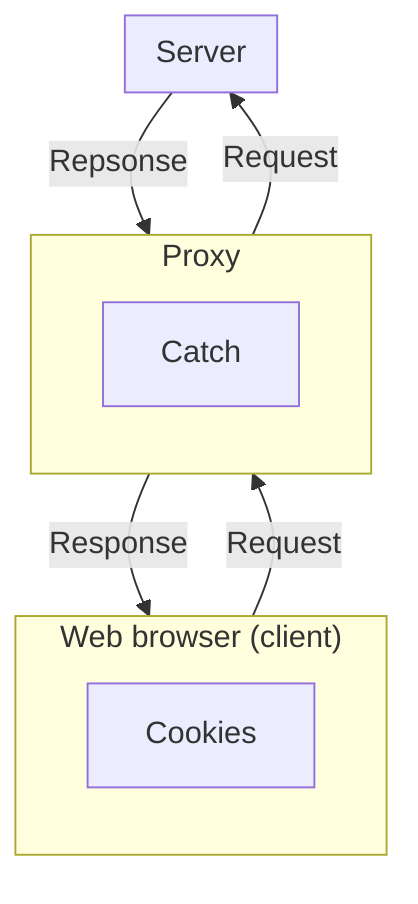
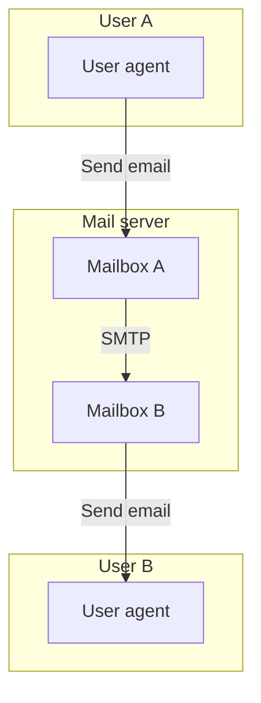
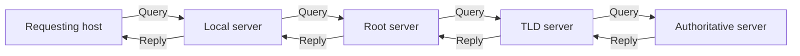

```insta-toc
---
title:
  name: Mục lục
  level: 1
  center: false
exclude: ""
style:
  listType: number
omit: []
levels:
  min: 1
  max: 6
---

# Mục lục

1. Nguyên lý của các ứng dụng mạng
    1. Đặc điểm của ứng dụng mạng
    2. Kiến trúc ứng dụng mạng
    3. Tiến trình
    4. Socket
    5. Định địa chỉ tiến trình
    6. Giao thức
2. Hệ thống web và Giao thức HTTP
    1. Giới thiệu HTTP (Hypertext transfer protocol)
    2. Phân loại HTTP và Các phiên bản HTTP
    3. HTTP message
        1. HTTP request
        2. HTTP response
    4. Cookies
    5. Web catching (Proxy server)
3. Hệ thống email
    1. Kiến trúc hệ thống email
    2. Định dạng mail
4. Hệ thống DNS (Domain name system)
    1. Giới thiệu DNS
    2. Cấu trúc DNS
        1. Mạng lưới DNS servers
        2. Cấu trúc cơ sở dữ liệu DNS
    3. Quy trình truy vấn và phản hồi
    4. Quy trình chèn thêm bản ghi vào cơ sở dữ liệu
5. Phân phối file trong kiến trúc P2P
    1. Thế mạnh của kiến trúc P2P
    2. Giao thức BitTorrent
```

# Nguyên lý của các ứng dụng mạng

## Đặc điểm của ứng dụng mạng

Ứng dụng mạng:
- Chạy trên các **host khác nhau**.
- Giao tiếp qua **mạng**.
- **Không** cần viết phần mềm cho các thiết bị trong mạng lõi.

## Kiến trúc ứng dụng mạng

Có 2 loại:

| **Mô hình** | Client - Server                                                                                                                                                  | Peer to peer (P2P, mô hình ngang hàng)                                                                                                                                                                                                                                                                         |
| ----------- | ---------------------------------------------------------------------------------------------------------------------------------------------------------------- | -------------------------------------------------------------------------------------------------------------------------------------------------------------------------------------------------------------------------------------------------------------------------------------------------------------- |
| **Server**  | - Luôn hoạt động.<br><br>- Địa chỉ IP cố định.<br><br>- Trung tâm phục vụ và lưu trữ<br>dữ liệu.                                                                 | - Không có server.                                                                                                                                                                                                                                                                                             |
| **Client**  | - Giao tiếp với server.<br><br>- Có thể kết nối không liên tục.<br><br>- Có thể dùng địa chỉ IP động.<br><br>- Không giao tiếp trực tiếp với<br>các client khác. | - Các hệ thống đầu cuối giao tiếp trực<br>tiếp với nhau.<br><br>- Các peer yêu cầu dịch vụ từ các peer<br>khác và cung cấp dịch vụ ngược lại từ các<br>peer khác.<br><br>=> Có khả năng tự mở rộng.<br><br>- Các peer được kết nối không liên tục và<br>có thể thay đổi địa chỉ IP.<br><br>- Quản lí phức tạp. |

Mỗi host được định danh bằng:
- 1 địa chỉ logic trên mạng là **địa chỉ IP**.
- 1 địa chỉ vật lý là **địa chỉ MAC**.

## Tiến trình

Ứng dụng mạng gồm nhiều **tiến trình (processes)** chạy trên các host, gửi thông điệp qua mạng.
- Trên **cùng host**, tiến trình giao tiếp qua **interprocess communication** của hệ điều hành.
- **Khác host**, tiến trình giao tiếp qua **trao đổi thông điệp (message exchange)**.

Có 2 loại tiến trình:
- **Client process**: Khởi tạo truyền thông.
- **Server process**: Chờ đợi để được liên lạc.

Mỗi tiến trình được định danh bằng 1 **số port**.

Chú ý trong kiến trúc P2P:
- Một host có thể vừa chạy client process, vừa chạy server process.
- Trong 1 phiên giao tiếp, vẫn phân biệt host nào là client, host nào là server.

## Socket

Socket là **giao diện phần mềm (API)** giữa application layer và transport layer. Có thể nói socket là cửa ra vào các tiến trình.

Mỗi socket đều được định danh bằng một **số cổng (port number)**.
- **Các port từ 0 - 1023 (Well-know ports)**: Dùng cho các dịch vụ chuẩn như HTTP, HTTPS, SMTP,...
- **Các port từ 1024 đến 65535 (Ephemeral ports)**: Do hệ thống tự cấp phát.

Dev kiểm soát phía application layer, nhưng chỉ có 2 lựa chọn phía transport layer:
1. Chọn giao thức (TCP hoặc UDP).
2. Điều chỉnh vài tham số (ví dụ buffer size).

## Định địa chỉ tiến trình

Để gửi dữ liệu cho đúng tiến trình, cần 2 thông tin:
1. **[[Network layer#Địa chỉ IP|Địa chỉ IP]]**: Địa chỉ logic của host (*khác với MAC là địa chỉ vật lý*). Địa chỉ IP là một dãy số, có thể viết dưới một số dạng khác:
	1. **Dạng ký tự dài (Domain / host name)**: VD `relay1.west-coast.enterprise.com`.
	2. **Dạng ký tự ngắn (Alias)**: VD tên miền trên có thể có 2 alias là `enterprise.com` hoặc `www.enterprise.com`.

2. **Số cổng (Port number)**: Định danh tiến trình trong host.

## Giao thức

Các thành phần Internet chạy **giao thức (protocols)** để gửi/nhận dữ liệu.

**Giao thức** quy định **định dạng** (cấu trúc) và **thứ tự** của các thông điệp trao đổi giữa các thực thể giao tiếp, cùng với **hành động** khi gửi/nhận thông điệp hoặc khi có sự kiện khác xảy ra.

Internet hỗ trợ 2 giao thức: [[Transport layer#TCP / UDP|TCP và UDP]].

# Hệ thống web và Giao thức HTTP



## Giới thiệu HTTP (Hypertext transfer protocol)

**HTTP** là:
- Dựa trên TCP.
- Số port là `80`.
- Chuyên phục vụ cho các ứng dụng web.
- Không lưu trạng thái vận chuyển (**stateless**). VD: Nếu client yêu cầu cùng một object 2 lần, server vẫn gửi lại, không nhớ lần trước..

## Phân loại HTTP và Các phiên bản HTTP

Có 2 loại:
1. **HTTP không bền vững (Non-Persistant)**:
	1. Một TCP connection chỉ vận chuyển được **1 object** (file) của trang web.
	2. Không có pipelining: Các request và response được gửi và nhận tuần tự.
	3. -> Lãng phí tài nguyên và thời gian.
	4. Thời gian đáp ứng: $2.\text{RTT}+\text{thời gian truyền object}$. VD: Số RTT để tải 10 object cho 1 trang web là 11 RTT.

2. **HTTP bền vững (Persistant)**:
	1. Một TCP connection có thể vận chuyển **nhiều object (Multiplexing)**. Toàn bộ object của trang web có thể được gửi 1 lần duy nhất.
	2. Cho phép **pipelining**: Gửi nhiều request đồng thời, không cần tuần tự từng request.

Các phiên bản HTTP ngày nay đều là persistant connection, thậm chí tối ưu thêm các tính năng khác.

| Tính năng                 | HTTP/1.1              | HTTP/2                         | HTTP/3 (QUIC)                |
| ------------------------- | --------------------- | ------------------------------ | ---------------------------- |
| Kết nối                   | Nhiều TCP connections | 1 TCP connection, multiplexing | 1 UDP (QUIC), multiplexing   |
| HOL blocking              | Có                    | Có ở TCP layer                 | Không (per-stream)           |
| Định dạng dữ liệu         | Text                  | Binary + Compression (HPACK)   | Binary + Compression (QPACK) |
| Mức độ ưu tiên truyền tin | Không                 | Có (weight + dependency)       | Có, đơn giản hơn             |
| Server Push               | Không                 | Có                             | Có                           |
| Thiết lập Kết nối         | TCP                   | TCP                            | TCP hỗ trợ 0 RTT             |
Trong đó:
- **HOL Blocking (Head-of-line blocking)**: Là hiện tượng nghẽn mạng khi một gói tin quá lớn đứng đầu luồng TCP, khiến các gói tin sau phải chờ.
- **Server push**: Là server có khả năng tự gửi về client quan trọng mà không cần client yêu cầu.
- **RTT (Round trip time)**: Là khoảng thời gian từ lúc client gửi request đến khi nhận response từ server.

## HTTP message

Có 2 loại message:
1. **Request**: Do client gửi đến server.
2. **Response**: Do server gửi về client.

### HTTP request

Gồm 3 thành phần:
1. **Request**: Gồm có:
	1. **Method**: Hành động client muốn thực hiện.
	2. **URL**: Địa chỉ của tài nguyên cần truy cập.
	3. **Version**: Phiên bản của HTTP.

2. **Header**: Gồm có:
	1. **Host**: Tên server.
	2. **Connection close**: Yêu cầu server ngắt kết nối khi hoàn thành response.
	3. **User agent**: Loại trình duyệt web.
	4. **Accept language**: Ngôn ngữ giao tiếp.

3. **Body**: Dữ liệu đính kèm theo cần server xử lý.

Một số HTTP Method:

| Method    | Ý nghĩa                                                                   |
| --------- | ------------------------------------------------------------------------- |
| `GET`     | **Lấy dữ liệu** từ server (chỉ đọc, không thay đổi trạng thái).           |
| `HEAD`    | Giống `GET` nhưng chỉ lấy phần header, không lấy body.                    |
| `POST`    | **Gửi dữ liệu mới** lên server (tạo mới hoặc xử lý).                      |
| `PUT`     | **Upload hoặc thay thế** toàn bộ tài nguyên tại URL chỉ định.             |
| `PATCH`   | **Cập nhật một phần tài nguyên** tại URL chỉ định.                        |
| `DELETE`  | **Xóa tài nguyên** tại URL chỉ định.                                      |

VD:
```sh
GET /somedir/page.html HTTP/1.1\r\n
Host: www.someschool.edu\r\n
Connection: close\r\n
User-agent: Mozilla/5.0\r\n
Accept-language: fr\r\n
Accept-encoding: gzip,deflate\r\n
Connection: keep-alive\r\n
```

Trong đó các `Accept-language` và `Accept-encoding` có thể có hậu tố `q:n` ám chỉ độ ưu tiên `n`, ưu tiên nhất khi `n` là `1`. Mặc định là `q:1`.

### HTTP response

Gồm 3 thành phần:
1. **Status**: Gồm có:
	1. **Version**: Phiên bản của HTTP.
	2. **Status code**: Trạng thái truyền dữ liệu dưới dạng mã số.
	3. **Status message/phrase**: Trạng thái truyền dữ liệu dưới dạng chữ.

2. **Header**: Gồm có:
	1. **Connection close**: Yêu cầu server ngắt kết nối khi hoàn thành response.
	2. **Date**: Thời điểm tạo response.
	3. **Server**: Loại server đang chạy.
	4. **Last modified**: Lần cuối tài nguyên được sửa.
	5. **Content length**: Kích thước tài nguyên.
	6. **Content type**: Kiểu tài nguyên (HTML, PNG,...).

3. **Body**: Tài nguyên mà client yêu cầu.

Một số HTTP status code / message phổ biến:

| Code  | Message                      | Ý nghĩa                                                                     |
| ----- | ---------------------------- | --------------------------------------------------------------------------- |
| `200` | `OK`                         | Nhận request, trả response thành công.                                      |
| `301` | `Moved Permanently`          | Trả response thất bại vì *tài nguyên cần tìm đã được chuyển sang URL khác*. |
| `400` | `Bad Request`                | Trả response thất bại vì *request không hợp lệ*.                            |
| `404` | `Not Found`                  | Trả response thất bại vì *không tìm thấy tài nguyên cần tìm*.               |
| `505` | `HTTP Version Not Supported` | Trả response thất bại vì *phiên bản HTTP không được hỗ trợ*.                |


VD:
```sh
HTTP/1.1 200 OK
Connection: close
Date: Tue, 18 Aug 2015 15:44:04 GMT
Server: Apache/2.2.3 (CentOS)
Last-Modified: Tue, 18 Aug 2015 15:11:03 GMT
Content-Length: 6821
Content-Type: text/html; char-set:UTF-8\r\n
```

## Cookies

Do HTTP có tính *stateless* nên cần có cookies. **Cookies** được dùng để tạo trạng thái cho người dùng.

Quy trình:
1. Khi server gửi về response sẽ đồng thời ghi dữ liệu vào cookie (Set cookie) -> File cookie **nằm tại client**, được **quản lý bởi browser**.
2. Khi browser gửi request sẽ đồng thời gửi dữ liệu từ cookie.

## Web catching (Proxy server)

**Web cache** là proxy lưu lại các object (ảnh, HTML, CSS, JS) được request gần đây.

Quy trình:
1. Browser gửi request đến cache.
2. Cache kiểm tra object có sẵn không.
	1. Nếu có, trả về ngay.
	2. Nếu không, catch gửi request đến server, nhận response, lưu lại và chuyển cho browser.

Như vậy:
- Catch là **server** đối với client.
- Catch là **client** đối với server.

**Lợi ích**:
1. Giảm thời gian phản hồi (nếu cache hit).
2. Giảm lưu lượng qua đường truyền quốc tế, tiết kiệm chi phí băng thông.
3. Tăng hiệu suất Internet toàn cục.

**Vấn đề phát sinh**: Dữ liệu trong catch có thể bị lỗi thời (stale) -> Dùng **Conditional GET**:
1. Server lần đầu gửi object kèm **last modified**.
2. Catch lưu object và **last modified**.
3. Khi nhận được request mới, catch gửi đi request có header `If-Modified-Since` tới server. Server kiểm tra và nếu object chưa bị thay đổi thì catch trả request về browser, không thì server sẽ trả request chứa object mới về catch.

# Hệ thống email

## Kiến trúc hệ thống email



Gồm 3 thành phần:
1. **User Agent (UA)**:
    - Là ứng dụng để người dùng **soạn/gửi/nhận** mail. VD: Outlook, Apple Mail, Gmail (web/app)...

2. **Mail Server**:
    - Là trung tâm hạ tầng e-mail.
    - Mỗi user có 1 **mailbox** để lưu thư.
    - Nếu server nhận không khả dụng, mail giữ trong **message queue** và thử gửi lại sau (30 phút/lần).

3. **SMTP (Simple Mail Transfer Protocol)**
    - Là giao thức application layer, dùng TCP, có chức năng nhận và đẩy mail vào mailbox của người nhận.
    - Quy trình:
        1. **SMTP client** (server gửi) mở kết nối đến **SMTP server** (server nhận).
        2. Kết nối logic (HELO/EHLO, MAIL FROM, RCPT TO, DATA, QUIT).
        3. Đẩy mail vào mailbox của người nhận.
    - **Persistent connection**: Có thể gửi nhiều mail trong cùng một kết nối TCP.

## Định dạng mail

Gồm 2 phần chính:
1. **Header**: Gồm có:
	1. **From**: Người gửi.
	2. **To**: Người nhận.
	3. **Subject**: Tiêu đề mail.
	4. Các trường khác **Bc, Bcc,...**.

2. **Body**: Nội dung mail.

VD:
```sh
From: alice@crepes.fr
To: bob@hamburger.edu
Subject: Searching for the meaning of life.

The meaning of life can be derived from philosophical and religious contemplation of, and scientific inquiries about, existence, social ties, consciousness, and happiness.
```

# Hệ thống DNS (Domain name system)

## Giới thiệu DNS

**DNS** là hệ thống chuyển đổi giữa *địa chỉ IP* và *tên miền*.

## Cấu trúc DNS

DNS gồm 2 thành phần chính:
1. 1 **Cơ sở dữ liệu phân tán** được cài đặt dưới dạng một hệ thống phân cấp các DNS server. Có hàng ngàn DNS server phân tán toàn cầu.
2. 1 **Giao thức application layer** cho phép host gửi truy vấn đến cơ sở dữ liệu.

### Mạng lưới DNS servers

Xây dựng DNS tập trung với 1 server thay vì phân tán có 4 nhược điểm:
1. **Single point of failure**: Server sập là Internet “sập” theo.
2. **Traffic overload**: Phải xử lý hàng triệu truy vấn (HTTP, email, …).
3. **Khoảng cách địa lý xa xôi**: Nếu server ở Mỹ, thì client ở Úc phải đi nửa vòng Trái Đất.
4. **Bảo trì phức tạp**: Cơ sở dữ liệu khổng lồ, phải cập nhật liên tục khi có host mới.

DNS có 3 lớp server chính:
1. **Root DNS servers (máy chủ gốc)**:
    - Hơn 1000 server toàn cầu.
    - Thực chất là **13 hệ thống root** được nhân bản, do 12 tổ chức quản lý (IANA điều phối).
    - Nhiệm vụ: trả về **địa chỉ TLD servers**.

2. **Top-Level Domain (TLD) servers (máy chủ miền cấp cao nhất)**:
    - Quản lý theo phần mở rộng tên miền (TLD): `.com`, `.org`, `.edu`, `.gov`,...
    - Nhiệm vụ: trả về **địa chỉ authoritative servers** cho domain cụ thể (như `amazon.com`).

3. **Authoritative DNS servers (máy chủ có thẩm quyền)**
    - Do từng tổ chức (trường đại học, công ty, …) quản lý.
    - Lưu **bản ghi ánh xạ domain và IP** cho các host (web server, mail server).
    - Có thể do chính tổ chức tự vận hành, hoặc thuê dịch vụ DNS provider.

4. **Local DNS servers (máy chủ cục bộ)** (Không nằm trong phân cắp lớp server):
	- Do *ISP (Internet Service Provider)* cung cấp cho người dùng khi kết nối mạng (qua DHCP).
	- Thường nằm gần host.

### Cấu trúc cơ sở dữ liệu DNS

**Bản ghi**: Gồm có 4 thành phần:
1. **TTL (Time to live)**: Thời gian giữ bản ghi tại catch.
2. **Type**: Loại bản ghi:

| Type    | Name                   | Value                  |
| ------- | ---------------------- | ---------------------- |
| `A`     | Hostname / Domain      | Địa chỉ IP             |
| `NS`    | Hostname / Domain      | Hostname / Domain      |
| `CNAME` | Alias                  | Alias                  |
| `MX`    | Alias của địa chỉ mail | Alias của địa chỉ mail |

**Message**: Có 2 loại là **Query** và **Reply**. Cả 2 đều có cùng định dạng gồm 5 phần:
1. **Header**: Gồm có:
	1. **ID**: Mã định danh message.
	2. **Flag**: Cờ trạng thái của message.
		1. `query/reply`: `0` = query, `1` = reply.
		2. `authoritative`: Đánh dấu khi gặp Authoritative DNS servers.
		3. `recursion desired`: Client yêu cầu server tiếp tục truy vấn đến phân cấp server tiếp theo.
		4. `recursion available`: Server thông báo có hỗ trợ truy vấn đến phân cấp server tiếp theo.
2. **Question section**: Thông tin truy vấn (*Name, Value*).
3. **Answer section**: Kết quả truy vấn (*Name, Value*).
4. **Authority section**: Danh sách các Authoritative server.
5. **Addition section**: Ghi chú.

## Quy trình truy vấn và phản hồi



Quy trình tra cứu gồm 2 bước chính, thể hiện 2 tính chất:
1. **Recursive query**: Host sẽ tra cứu tuần tự ở Local -> Root -> TLD -> Authoritative.
2. **Iterative query**: Sau khi nhận được query, các server sẽ kiểm tra. Nếu biết doamin này ứng với địa chỉ IP nào thì sẽ gửi về, không thì sẽ gửi địa chỉ ở server cấp tiếp theo để gửi query tiếp.
3. Trong quá trình phản hồi kết quả truy vấn, các server cũng sẽ lưu lại bản ghi ánh xạ domain và địa chỉ IP để tiện cho lần truy vấn tiếp theo (**catch**).

## Quy trình chèn thêm bản ghi vào cơ sở dữ liệu

1. Đăng ký tên miền với nhà đăng ký (registra) chính thức, bao gồm cung cấp tên miền  và địa chỉ IP của authoritative server.
2. Registra đưa vào TLD server bản ghi loại `NS` và `A`.

# Phân phối file trong kiến trúc P2P

## Thế mạnh của kiến trúc P2P

Một ví dụ điển hình chức minh thế mạnh kiến trúc P2P là việc phân phối 1 file lớn cho nhiều host (peer).
- **Đối với kiến trúc Client-Server**: Server phải gửi $n$ bản sao file cho $n$ peer, gây hao tốn băng thông.
- **Đối với kiến trúc P2P**: Các peer chia sẻ file cho nhau, giảm áp lực cho serser.

## Giao thức BitTorrent

**BitTorrent** là giao thức P2P phổ biến nhất để phân phối file.
- **Torrent:** Là tập hợp tất cả các peers cùng chia sẻ một file.
- File được chia thành các **chunks (mảnh)**, thường có kích thước **256 KB**.
- Peer ban đầu không có chunk nào, nó tải dần chunk về từ các peer khác và cũng dần tải chunk của mình cho các peer khác.
- Peer có thể rời torrent bất cứ lúc nào, kể cả khi chưa tải xong.

**Quy trình**:
1. **Đăng ký track**:
    - **Tracker** là node cơ sở trong torrent.
    - Khi có peer tham gia torrent, nó đăng ký với tracker.
    - Tracker trả về danh sách các peers khác.

2. **Liên kết với các peer khác (neighbor)**
    - Peer thiết lập kết nối TCP với các peers trong danh sách.
    - Neighbor thay đổi theo thời gian (có thể rời hoặc thêm mới).

3. **Trao đổi chunk**
    - Khi 1 peer muốn có dữ liệu, nó tải từ các neighbor những chunk còn thiếu.
    - Có 2 chiến lược tải chunk hiệu quả:
	    1. **Rarest first**: Ưu tiên tải những *chunk hiếm* (những chunk không được nhiều neighbor giữ).
	    2. **Tit-for-tat**: Đo đạc rồi *chọn ra 4 peer có tốc độ cao nhất* để tải chunk. Cứ mỗi 10s, danh sách 4 peer này sẽ được cập nhật.
	- Sau mỗi 30s, 1 peer sẽ chọn 1 peer khác để upload chunk.
