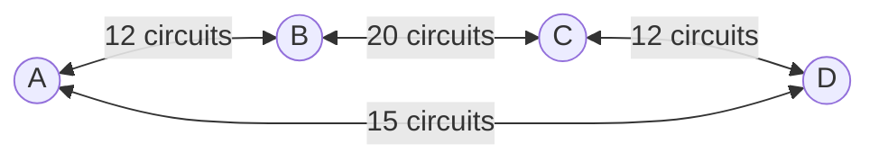

```insta-toc
---
title:
  name: Mục lục
  level: 1
  center: false
exclude: ""
style:
  listType: number
omit: []
levels:
  min: 1
  max: 6
---

# Mục lục

1. Tổng quan về mạng máy tính
```

# Tổng quan về mạng máy tính

**Câu 1**: Cho mạng gồm 4 router:



**Câu 1.1**: Mạng trên có thể chấp nhận tối đa mấy kết nối?
12 + 20 + 12 + 15 = 60 kết nối.

**Câu 1.2**: Chuyện gì xảy ra nếu có thêm host yêu cầu kết nối?
Host đó sẽ bị từ chối vào mạng và đưa vào queue.

**Câu 1.3**: Nếu mỗi kết nối được tính bằng 2 hop (đi qua 3 routers liên tiếp) thì có tối đa có bao nhiêu kết nối?
- Từ A đến C: 12 kết nối.
- Từ B đến D: 12 kết nối.
- Từ C đến A: 12 kết nối.
- Từ D đến B: 12 kết nối.
Tổng có 12 * 4 = 48 kết nối.

**Câu 1.4**:


