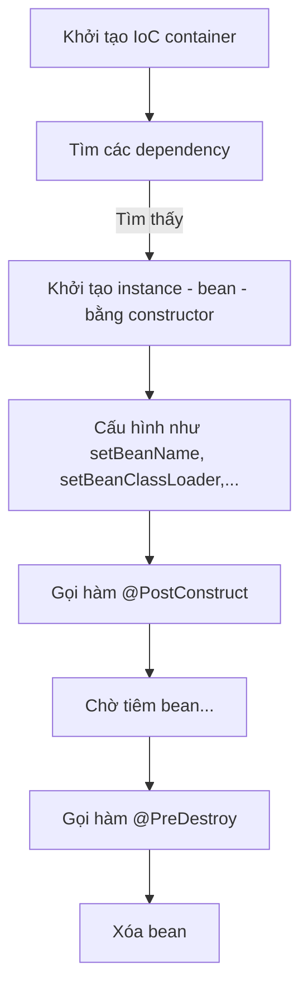

# Tổng quan về bean lifecycle

Spring Boot từ thời điểm chạy lần đầu tới khi shutdown thì các [[Tổng quan về flow của Spring Boot#@SpringBootApplication|bean]] nó quản lý sẽ có một vòng đời như sau:



VD:
```java
import org.springframework.stereotype.Component;
import javax.annotation.PostConstruct;
import javax.annotation.PreDestroy;

@Component
public class Girl {
    @PostConstruct
    public void postConstruct(){
        System.out.println("\t>> postConstruct bean");
    }
	
    @PreDestroy
    public void preDestroy(){
        System.out.println("\t>> preDestroy bean");
    }
}
```

```java
import org.springframework.boot.SpringApplication;
import org.springframework.boot.autoconfigure.SpringBootApplication;
import org.springframework.context.ApplicationContext;
import org.springframework.context.ConfigurableApplicationContext;

@SpringBootApplication
public class App {
    public static void main(String[] args) {
        System.out.println("> Pre-create IoC container");
        ApplicationContext context = SpringApplication.run(App.class, args);
        System.out.println("> Created IoC container");
        
        Girl girl = context.getBean(Girl.class);
        
        System.out.println("> Pre-destroy bean");
        ((ConfigurableApplicationContext) context).getBeanFactory().destroyBean(girl);
        System.out.println("> Destroyed bean");
    }
}
```

Kết quả:
```shell
> Pre-create IoC container
> Pre-create IoC container
	>> postConstruct bean
> Created IoC container
> Pre-destroy bean
	>> preDestroy bean
> Destroyed bean
```

Chú rằng rằng dòng `> Pre-create IoC container` được in 2 lần do hàm `main()` được gọi 2 lần.
1. Lần 1: Do dev gọi.
2. Lần 2: Do Spring Boot gọi khi IoC container được tạo ra.

# Điều chỉnh phạm vi Component scan

Mặc định, Spring Boot sẽ tìm các dependency *nằm cùng package với `main` hoặc package con*.

Bạn có thể tùy chỉnh phạm vi scan bằng 2 cách:
1. `@ComponentScan("com.example.demo.others") @SpringBootApplication`.
2. `@SpringBootApplication(scanBasePackages = "com.example.demo.others")`.

Lúc này, Spring sẽ chỉ tìm các dependency ở `java/com/example/demo/others` mà thôi.

Cấu hình nhiều nguồn:
1. `@ComponentScan("others1", "others2") @SpringBootApplication`.
2. `@SpringBootApplication(scanBasePackages = {"others1", "others2"})`.

# Bean injection

## Tổng quan quá trình tiêm bean

Sau khi tìm thấy một class đánh dấu `@Component` thì quá trình inject bean xảy ra theo cách như sau:
1. Nếu class không có constructor hay setter. Thì sẽ sử dụng [[Java reflection]] để đưa đối tượng vào thuộc tính có đánh dấu `@Autowired`.
2. Nếu có constructor thì sẽ inject bean vào bởi tham số của hàm.
3. Nếu có setter thì sẽ inject Bean vào bởi tham số của hàm

## Giải quyết xung đột tiêm bean

Trong quá trình tiêm, nếu Spring Boot tìm thấy nhiều hơn một bean phù hợp để tiêm thì sẽ dẫn đến lỗi.

Có thể giải quyết bằng cách dùng một số annotation sau đặt vào bean:
1. `@Primary`: Đánh dấu rằng bean này được ưu tiên được chọn để tiêm khi có xung đột.
2. `@Qualifier("beanName")`: Đánh dấu rằng bean này chỉ nhận tiêm bean `beanName`. Chú ý rằng `beanName` phải được đánh dấu bằng `@Component("beanName")` trước.

VD: `@Primary`:
```java
@Component
@Primary
public class Naked implements Outfit {
    @Override
    public void wear() {
        // ...
    }
}
```
Lúc này, `Naked` luôn được ưu tiên để tiêm.

VD: `@Qualifier`:
```java
@Component("bikini")
public class Bikini implements Outfit {
    @Override
    public void wear() {
	    // ...
    }
}

@Component("naked")
public class Naked implements Outfit {
    @Override
    public void wear() {
        // ...
    }
}

@Component
public class Girl {
    Outfit outfit;
    
    public Girl(@Qualifier("naked") Outfit outfit) {
        this.outfit = outfit;
    }
}
```
Lúc này, `Girl` chỉ nhận `Naked` (`"naked"`) để tiêm vào.
