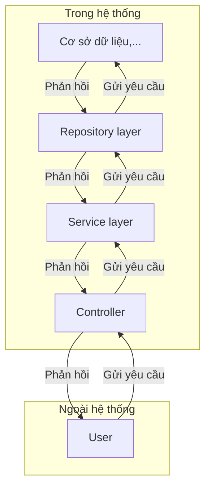
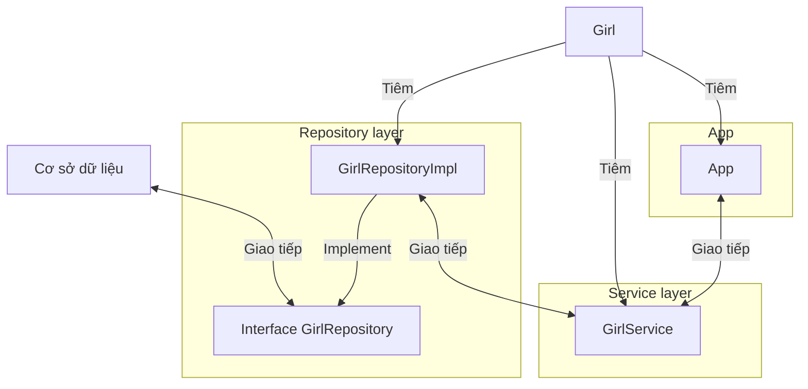
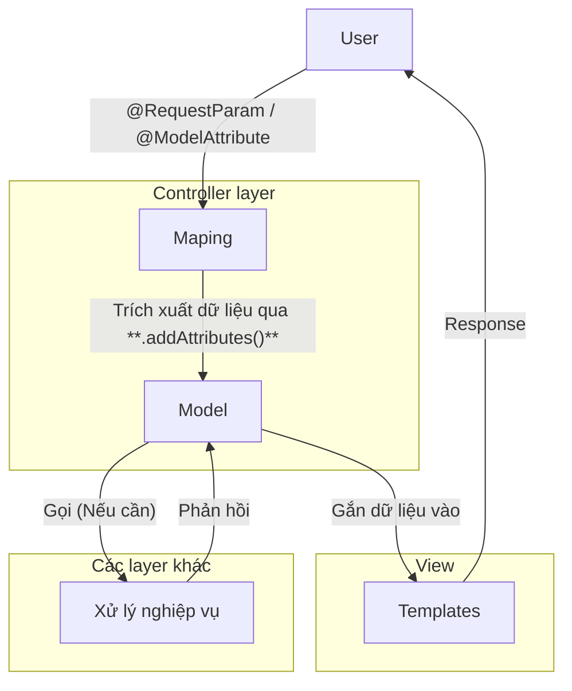
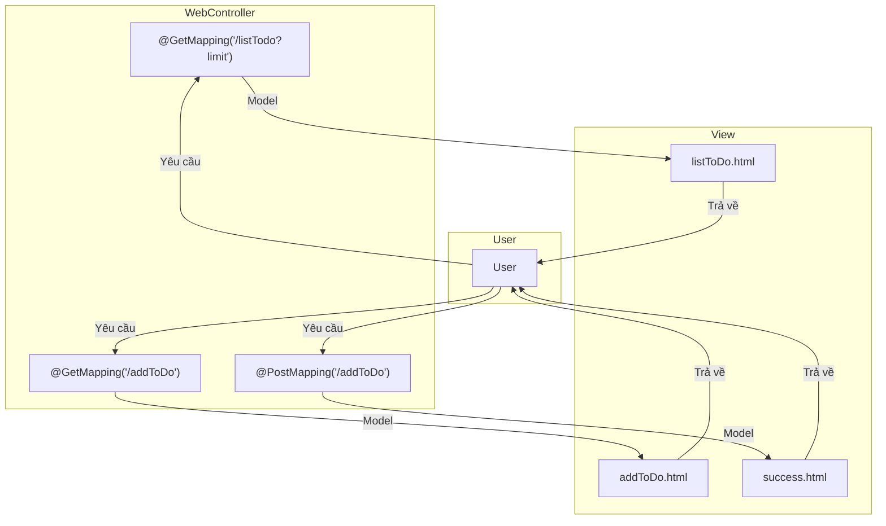

# Tổng quan

Kiến trúc MVC (CSR) trong [[Giới thiệu & Cài đặt Spring Boot#Spring, Spring Boot|Spring Boot]] được xây dựng dựa trên ý tưởng các nguyên lý thiết kế OOP, trong đó có [[OOP nâng cao#Tính đóng gói (Encapsulation)|tính đóng gói (encapsulation)]], có một số biểu thị sau:
1. [[OOP nâng cao#Inversion of control|Dependency inversion]].
2. Hệ thống được chia thành nhiều lớp (layer), mỗi layer phục vụ các mục đích nhất định trong phạm vi của mình. Khi muốn thực hiện một công việc ngoài phạm vi thì sẽ đưa công việc tới các layer gần cơ sở dữ liệu hơn.

Có 3 layer chính:
1. **Consumer Layer (Controller)**: Là tầng giao tiếp với bên ngoài và handler các request từ bên ngoài tới hệ thống.
2. **Service Layer**: Thực hiện các nghiệp vụ và xử lý logic.
3. **Repository Layer**: Chịu trách nhiệm giao tiếp với các cơ sở dữ liệu, thiết bị lưu trữ, xử lý query và trả về các kiểu dữ liệu mà tầng Service yêu cầu.



# Quản lý các tầng

## Lớp Repository và Service

Về mặt lập trình, lớp repository (đánh dấu bằng `@Repository`) và service (đánh dấu bằng `@Service`) thật chất là các lớp và được coi là component.

Về bản chất thì bạn có thể sử dụng thay thế 3 annotation `@Component`, `@Service` và `@Repository` cho nhau mà không ảnh hưởng gì tới code của bạn cả. Nó vẫn sẽ hoạt động. Tuy nhiên từ góc độ thiết kế thì chúng ta cần phân rõ 3 Annotation này cho các Class đảm nhiệm đúng nhiệm vụ của nó.
- `@Service` gắn cho các bean đảm nhiệm xử lý logic.
- `@Repository` gắn cho các bean đảm nhiệm giao tiếp với database.
- `@Component` gắn cho các bean khác.

Trên thực tế:
- **Repository**: Cần một interface vì cần tạo các lớp giao tiếp với các thành phần khác nhau của database theo các cách khác nhau.
- **Service**: Chỉ cần một lớp thường để xử lý logic cho hệ thống.

Tùy vào nhu cầu thực tế mà có cách xây dựng repository và service khác nhau.

VD:

Model dữ liệu:
```java
public class Girl {
    private String name;
	
    public Girl(String name) {
        this.name = name;
    }
	
    public String getName() {
        return name;
    }
	
    public void setName(String name) {
        this.name = name;
    }
	
    @Override
    public String toString() {
        return "Girl(" + this.name + ")";
    }
}
```

*Repository*: Giao tiếp với cơ sở dữ liệu qua interface.
```java
public interface GirlRepository {
	// Query by name
	// ...
    Girl getGirlByName(String name);
}

@Repository
public class GirlRepositoryImpl implements GirlRepository {
	@Override
	public Girl getGirlByName(String name) {
		// Query by name
		// ...
		return new Girl(name);
	}
}
```

*Service*: Xử lý và trả về một `Girl` ngẫu nhiên từ cơ sở dữ liệu (thông qua `girlRepository`).
```java
import org.apache.commons.lang3.RandomStringUtils;
import org.springframework.beans.factory.annotation.Autowired;
import org.springframework.stereotype.Service;

@Service
public class GirlService {
    @Autowired
    private GirlRepository girlRepository;

    public Girl getRandomGirl(){
        // ...
        return girlRepository.getGirlByName(name);
    }

    public String randomGirlName(int length) {
        // ...
        return RandomStringUtils.randomAlphanumeric(length).toLowerCase();
    }
}
```

Chương trình chính:
```java
import org.springframework.boot.SpringApplication;
import org.springframework.boot.autoconfigure.SpringBootApplication;
import org.springframework.context.ApplicationContext;

@SpringBootApplication
public class App {
    public static void main(String[] args) {
        ApplicationContext context = SpringApplication.run(App.class, args);
		
        // Lấy ra bean GirlService
        GirlService girlService = context.getBean(GirlService.class);
        
        // Sử dụng service
        Girl girl = girlService.getRandomGirl();
    }
}
```

Mô hình tổng thể:



## Lớp Controller

### Tổng quan quy trình

`@Controller` là nơi tiếp nhận các thông tin request từ phía người dùng. Nó có nhiệm vụ đón nhận các yêu cầu (kèm theo thông tin request) và chuyển các yêu cầu này xuống cho tầng `@Serivce` xử lý logic.

Quy trình thực hiện đại khái như sau:
1. User gửi request đến địa chỉ được quy định tại các method mapping (`@GetMapping`, `@PostMapping`,...). Thực thi method đó khi nhận được request.
2. Các thông tin của request được gửi qua `@RequestParams` (đối với biến đơn) / `@ModelAttribute` (đối với object), lấy các dữ liệu cần thiết ra và gắn vào đối tượng `Model` bằng `.addAttributes()`. Đồng thời có thể gọi các layer khác để xử lý trung gian nếu có. Lớp `Model` là lớp chứa thông tin về request, được dùng gắn vào template trả về response. 
3. Trả về template sau khi gắn dữ liệu vào cho user.



VD1: *Trả về HTML không tham số*:

`resources/templates/index.html`
```html
<!DOCTYPE html>
<html>
<head>
  <title>Hello World</title>
</head>
<body>

<h1>Đây là một trang web</h1>

</body>
</html>
```

Controller:
```java
import org.springframework.stereotype.Controller;
import org.springframework.web.bind.annotation.GetMapping;

@Controller
public class WebController {
    @GetMapping("/")
    public String index() {
        return "index"; // Trả về file index.html
    }
}
```

Lúc này, server đã chạy trên `http://localhost:8080`, khi bạn vào địa chỉ `/` thì `index.html` sẽ được trả về.

VD2: *Trả về HTML có tham số*:

`resources/templates/hello.html`
```html
<!DOCTYPE html>
<html lang="en" xmlns:th="http://www.thymeleaf.org">
<head>
  <title>Hello World</title>
</head>
<body>

<h1 th:text="'Hello, ' + ${name}"></h1>

<a href="/">Trang chủ</a>

</body>
</html>
```

```java
import org.springframework.stereotype.Controller;
import org.springframework.ui.Model;
import org.springframework.web.bind.annotation.GetMapping;
import org.springframework.web.bind.annotation.RequestParam;

@Controller
public class WebController {
    @GetMapping("/hello")
    public String hello(
		@RequestParam(
			name = "name",
			required = false,
			defaultValue = ""
		) String name,
        Model model
    ) {
        model.addAttribute("name", name);
        
        return "hello";
    }
}
```
Lúc này, `name` trở thành một parameter (Không bắt buộc, có giá trị mặc định là `""`). Khi truy cập vào `http://localhost:8080/hello?name=Loda` chẳng hạn, `name` sẽ là `Loda` nhờ vào thao tác gán `.addAttribute()`.

### `@GetMapping`, `@PostMapping`

`@GetMapping` có nhiệm vụ đánh dấu hàm xử lý GET request trong controller, tương tự với `@PostMapping`.

VD:
```java
@Controller
public class WebController {
    @GetMapping("/addTodo")
    public String addTodo(Model model) {
        return "addTodo";
    }
    
    @PostMapping("/addTodo")
    public String addTodo(Model model) {
        return "success";
    }
}
```
Cả 2 hàm trên đều cùng một path là `/addToDo` nhưng với method khác nhau (GET hay POST) thì sẽ có cách xử lý khác nhau.

### `@RequestMapping`

Ngoài cách dùng các annotation riêng lẻ để chỉ thị method nào xử lý HTTP method nào, bạn có thể dùng `@RequestMapping` với tham số `method` cho minh bạch:

VD:
```java
@Controller
@RequestMapping("api/v1")
public class WebController {
    @RequestMapping(value = "/addTodo", method = RequestMethod.GET)
    public String addTodo(Model model) {
        return "addTodo";
    }
    
    @RequestMapping(value = "/addTodo", method = RequestMethod.POST)
    public String addTodo(@ModelAttribute Todo todo) {
        return "success";
    }
}
```
Các path dẫn đến các method trên đều là `api/v1/addToDo`.


**VD tổng hợp**: Xây dựng web đơn giản cho phép quản lý danh sách công việc cần làm với 3 API sau:
1. `GET /addToDo?limit=null`: Trả về `limit` công việc cần làm.
2. `GET /addToDo`: Trả về webpage cho phép user nhập công việc cần làm.
3. `POST /addToDo`: Thêm công việc cần làm trên giao diện vào hệ thống.

Flow tổng quan:


Model dữ liệu tượng trưng cho mỗi công việc:
```java
import lombok.Data;

@Data
public class Todo {
    public String title;
    public String detail;
}
```

Controller:

`WebController.java`
```java
@Controller
public class WebController {
    List<Todo> todoList = new CopyOnWriteArrayList<>();
    
    @GetMapping("/listTodo")
    public String index(
	    Model model,
	    @RequestParam(value = "limit", required = false) Integer limit
	) {
        model.addAttribute(
	        "todoList",
	        limit != null ? todoList.subList(0, limit) : todoList
	    );
	    
        return "listTodo";
    }
    
    @GetMapping("/addTodo")
	public String addTodo(Model model) {
	    model.addAttribute("todo", new Todo());
	    return "addTodo";
	}
	
	@PostMapping("/addTodo")
	public String addTodo(@ModelAttribute Todo todo) {
	    todoList.add(todo);
	    return "success";
	}
}
```

Template:

`listToDo.html`: Hiển thị danh sách công việc cần làm.
```html
<!-- ... -->
<body>
    <h1>Danh sách việc cần làm:</h1>
    
    <ul>
      <!--Duyệt qua toàn bộ phần tử trong biến "todoList"-->
      <li th:each="todo : ${todoList}">
        <!--Với mỗi phần tử, lấy ra title và detail-->
        <span th:text="*{todo.getTitle()}"></span> :
        <span th:text="*{todo.getDetail()}"></span>
      </li>
    </ul>
    
    <a th:href="@{/addTodo}" class="btn btn-success"> + Thêm công việc</a>
  </body>
```

`addToDo.html`: Hiển thị giao diện cho user nhập dữ liệu:
```html
<!-- ... -->
<body>
	<h1>To-do</h1>
	
	<form th:action="@{/addTodo}" th:object="${todo}" method="post">
		<p>Title: <input type="text" th:field="*{title}" /></p>
		<p>Detail: <input type="text" th:field="*{detail}" /></p>
		<p><button type="submit" class="btn btn-success">Add</button></p>
	</form>
</body>
```

Ở đây, thẻ `form` sẽ tạo một request Form object gửi cho Spring Boot với 2 trường dữ liệu là `todo.title` và `todo.detail`. Cho nên ở `@PostMapping("/addTodo")`, ta mới dùng `@ModelAttribute` thay vì `@RequestParam`.

`success.html`: Hiển thị giao diện thông báo đã cập nhật thành công:
```html
<!-- ... -->
<body>
	<h1>To-do</h1>
	<h1>Thêm thành công!</h1>
	
	<a th:href="@{/listTodo}" class="btn btn-primary">
		Xem danh sách công việc
	</a>
</body>
```


