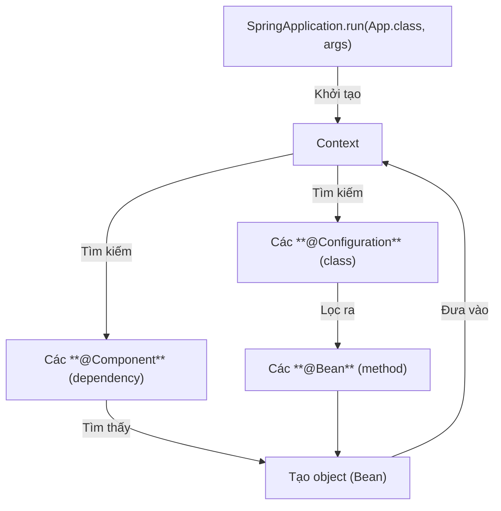

# `@SpringBootApplication`

[[Giới thiệu & Cài đặt Spring Boot|Spring Boot]] chạy từ hàm `main()` thuộc class có  [[6.1. Annotation|annotation]] `@SpringBootApplication`:

```java
import org.springframework.boot.SpringApplication;
import org.springframework.boot.autoconfigure.SpringBootApplication;
import org.springframework.context.ApplicationContext;

@SpringBootApplication
public class App {
    public static void main(String[] args) {
        SpringApplication.run(App.class, args);
    }
}
```

**Quy trình hoạt động:** Khi `SpringApplication.run(App.class, args);` được chạy:
- Tìm các dependency (là các lớp có annotation `@Component`) *nằm cùng package với `main` hoặc package con*.
- Tạo đối tượng của dependency (**Bean**) vào một container thuộc lớp **ApplicationContext**. ApplicationContext là một đối tượng của lớp **IoC container** có chức năng khởi tạo, cấu hình, quản lý, tiêm các bean.
- Ngoài ra, bean cũng được tạo ra từ các lớp có annotation `@Configuration` và các method có annotation `@Bean` (thuộc lớp đó).
- Khi có chỉ thị dùng dependency, như `.getBean()` hay `@Autowired`, Spring Boot sẽ lấy các bean từ context ra và tiêm vào đó.



Đây là cách viết tường minh hơn:
```java
@SpringBootApplication
public class App {
    public static void main(String[] args) {
        ApplicationContext context = SpringApplication.run(App.class, args);
    }
}
```

**Chú ý**:
- Tất cả các bean được đưa vào context đều là **Singleton**, tức là mỗi dependency chỉ có duy nhất một đối tượng được tạo ra và được đưa vào context. Và dù bạn gọi bean đó ra dùng bao nhiêu lần, thì Spring Boot vẫn chỉ lấy ra đúng 1 đối tượng.
- Trong trường hợp bạn muốn mỗi lần sử dụng là một đối tượng mới hoàn toàn, hãy gắn thêm `@Scope("prototype")` vào cạnh `@Component`.

# Xây dựng bean

## `@Component`

`@Component` là annotation đánh dấu cho Spring Boot biết class nào dùng để tạo bean.

VD:

Có Bean sau:
```java
@Component
public class Bikini implements Outfit {
    @Override
    public void wear() {
        // ...
    }
}
```

```java
@SpringBootApplication
public class App {
    public static void main(String[] args) {
        ApplicationContext context = SpringApplication.run(App.class, args);
        
        Outfit outfit = context.getBean(Outfit.class);
        outfit.wear();
    }
}
```
Lúc này, `outfit` là `Bikini`, bởi vì chỉ có `Bikini` implements đến `Outfit` và được đánh dấu là `@Component`.

## `@Configuration` và `@Bean`

Ngoài cách xây dựng bean từ `@Component`, tức toàn bộ class đều là một bean, Spring Boot cho phép tạo ra bean từ các method được gán `@Bean` của các lớp `@Configuration` tương ứng.

VD1: *Tạo bean từ class ngoài project*:

Bạn muốn cấu hình kết nối database, nhưng class `HikariDataSource` nằm trong thư viện *HikariCP*, không sửa được code để thêm `@Component`, chỉ còn cách dùng `@Configuration` và `@Bean`:

```java
@Configuration
public class AppConfig {
    @Bean
    public DataSource dataSource() {
        HikariDataSource ds = new HikariDataSource();
        ds.setJdbcUrl("jdbc:mysql://localhost:3306/mydb");
        ds.setUsername("root");
        ds.setPassword("123456");
        return ds;
    }
}
```

VD2: *Tạo nhiều object thuộc nhiều class khác nhau từ cùng 1 class*:

Giả sử bạn muốn kết nối hai database MySQL khác nhau thông qua class `AppConfig`, nhưng `@Component` chỉ cho phép tạo mỗi class 1 bean, chỉ còn cách dùng `@Configuration` và `@Bean`:

Lớp `DatabaseConnector`:
```java
public abstract class DatabaseConnector {
    private String url;
    
    public abstract void connect();
    
    public String getUrl() {
        return url;
    }
    
    public void setUrl(String url) {
        this.url = url;
    }
}
```

```java
public class MySqlConnector extends DatabaseConnector {
    @Override
    public void connect() {
        // ...
    }
}
```

```java
@Configuration
public class AppConfig {
    @Bean("mysql1Connector")
    DatabaseConnector mysql1() {
        return new MySqlConnector("jdbc:mysql://host1:3306/db1");
    }
	
    @Bean("mysql2Connector")
    DatabaseConnector mysql2() {
        return new MySqlConnector("jdbc:mysql://host2:3306/db2");
    }
}
```

# Sử dụng bean

## `.getBean()`


## `@Autowired`

Những đối tượng được đánh dấu là `@Autowired` đề nghị Spring Boot tìm một bean thích hợp và tiêm vào đó.

VD:
```java
@Component
public class Girl {
    @Autowired
    Outfit outfit;
    
    public Girl(Outfit outfit) {
        this.outfit = outfit;
    }
}
```
Lúc này, `outfit` là `Bikini`.

## `.value()`


