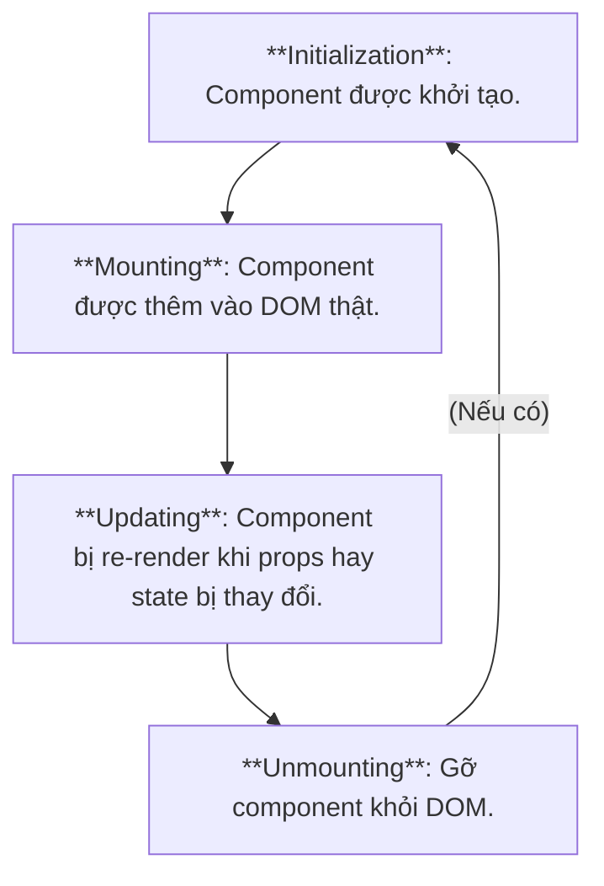
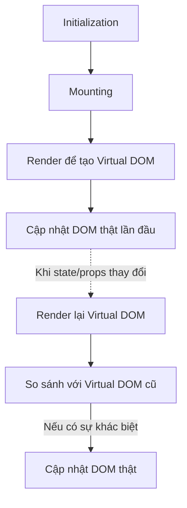

**Component lifecycle** là quy trình các giai đoạn mà một [[JSX#Function component|React component]] đi qua, từ khi được tạo ra, cập nhật, bị xóa khỏi giao diện.

Trong đó, **render** là quá trình React chuyển JSX thành cấu trúc DOM ảo (Virtual DOM) và sau đó cập nhật DOM thực tế nếu có thay đổi.



**Hook** là các hàm gắn vào [[JSX#Function component|function component]] cho phép bạn mô phỏng lifecycle.

Có 2 loại hook thường dùng:

# UseState

## Tổng quan

`useState` là hook giúp bạn thay đổi nội dung của các component, cũng tương tự như việc lắng nghe các [[DOM#Sự kiện|sự kiện]].

Nhập vào `useState`:
```jsx
import { useState } from 'react';
```

Cú pháp:
```jsx
function Component() {
	const [state, setState] = useState(initState);
	// ...
}
```
`initState` là giá trị khởi tạo, chỉ được khởi tạo 1 lần duy nhất kể cả khi `Component` render mấy lần.
Hàm `useState` trả về 1 mảng có 2 phần tử:
1. `state`: Giá trị hiện tại của component. Khi `state` thay đổi thì component sẽ được re-render.
2. `setState`: Một hàm có chức năng thay đổi `state`. 

## Ví dụ

VD1: Sử dụng `useState` cơ bản.
```jsx
function App() {
	const [counter, setCounter] = useState(1);
	
	const handleIncrease = () => setCounter(counter + 1);
	
	return (
		<div>
			<h1>Current counter: {counter}</h1>
			<button onClick={handleIncrease}>Increase!</button>
		</div>
	);
}
```
- Đầu tiên, giá trị của `state` là `1` (nhờ vào `useState(1)`).
- Mỗi khi `button` được bấm, `handleIncrease` được kích hoạt, dẫn đến kích hoạt `setCounter(counter + 1)` để tăng `counter` lên 1 đơn vị.
Tóm lại, component trên có chức năng tăng `counter` lên 1 đơn vị mỗi lần `button` được click.

VD1.2: Vấn đề re-render của `useState`.
```jsx
function App() {
	const [counter, setCounter] = useState(1);
	
	const handleIncrease = () => {
		setCounter(counter + 1);
		setCounter(counter + 1);
	}
	
	return (
		<div>
			<h1>Current counter: {counter}</h1>
			<button onClick={handleIncrease}>Increase!</button>
		</div>
	);
}
```
Dù `setCounter` 2 lần nhưng trên thực tế, `state` chỉ tăng lên 1 mỗi lần nhấn `button`. Lý do là vì `setCounter` là hàm bất đồng bộ nên 2 lần gọi `setCounter` được thực hiện cùng lúc và `state` vẫn là giá trị cũ.

VD2: Dùng `setState` với callback:
```jsx
function App() {
	const [counter, setCounter] = useState(1);
	
	const handleIncrease = () => {
		setCounter(preState => preState + 1);
		setCounter(preState => preState + 1);
	}
	
	return (
		<div>
			<h1>Current counter: {counter}</h1>
			<button onClick={handleIncrease}>Increase!</button>
		</div>
	);
}
```
Ở lần gọi `setCounter` đầu tiên, `preState` sẽ nhận `state` làm giá trị, tăng lên 1, sau đó trả về làm giá trị cho `state`. Cho nên ở lần gọi `setCounter` tiếp theo, `state` thật sự được tăng lên 1 nữa, tổng cộng là tăng lên 2.

VD3: Dùng `setState` với object:
```jsx
const [info, setInfo] = useState({
	name: "A",
	age: 18,
	address: "TP. HCM"
});

const handleUpdate = () => setInfo({
	...info,
	name: "B"
})
```
Đối với object, cần dùng toán tử spread để giữ lại dữ liệu cũ, sau đó mới thêm trường hoặc sửa giá trị.

# UseEffect

`useEffect` là hook giúp bạn triển khai các Side effect như lắng nghe các [[DOM#Sự kiện|sự kiện]] hay [[Fetch API|gọi API]] nhằm thay đổi dữ liệu. Thường kết hợp với `useState` để thay đổi nội dung của component.

Nhập vào `useEffect`:
```jsx
import { useEffect } from 'react';
```

Cú pháp:
```jsx
useEffect(callback, [deps]);
```
`useEffect` sẽ gọi `callback` dựa vào đối số của `[deps]`. Cụ thể:
- Khi không khai báo đối số, `callback` sẽ được gọi mỗi khi component render.
- Khi đối số là `[]`, `callback` chỉ được gọi 1 lần khi component mouting (render lần đầu).
- Khi đối số là `[deps]`,`callback` sẽ được gọi mỗi khi giá trị của `deps` thay đổi.
